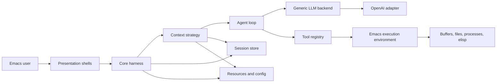
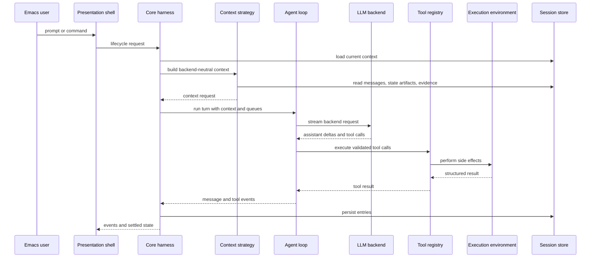

# Architecture

## Project Overview

`e` is an Emacs-hosted agent runtime inspired by pi-core. It should let Emacs run live-configurable agents that can inspect editor state, operate tools, and, when explicitly authorized, modify Emacs configuration or their own harnesses.

The repository now contains the first usable Emacs-hosted agent path. The package entry point, event helpers, in-memory session store, context strategy seam, layer and context-provider seam, backend-neutral adapter contract, ChatGPT-backed OpenAI/Codex adapter, tool registry, Emacs base layer, buffer and elisp tools, loop, harness service, async turn settlement, basic chat presentation, development reload helper, and ERT tests exist. The architecture below still includes target-state components that have not been implemented yet, especially durable persistence, richer context management, permission controls, and harness self-modification tools.

The primary runtime surfaces are expected to be an Emacs Lisp harness API, context-management strategies, Emacs presentation shells, explicit tool adapters, session persistence, and generic LLM backend adapters. The first provider target is OpenAI API access through ChatGPT subscription auth, but provider details must remain outside core harness policy.

## Table Of Contents

- project overview: L3-L9
- architecture overview: L25-L54
- boundaries and invariants: L56-L76
- repository mapping: L78-L113
- components: L115-L178
- data and control flow: L180-L215
- public surfaces: L217-L232
- extension points: L234-L238
- testing and verification: L240-L246
- change management: L248-L250
- architecture discussion: L252-L270

## Architecture Overview

The central architecture is a stable harness core with replaceable shells around it. Presentation code renders state and submits user intent. The harness owns agent lifecycle, durable session state, model selection, tool execution, event emission, and backend dispatch. Side effects cross through explicit adapters.

The target shape is:

- Core harness: lifecycle, state, queues, events, tools, resources, and session coordination.
- Agent loop: context transformation, model streaming, tool-call handling, and stop conditions.
- Context management: strategy-selected construction of backend context from session state, prompts, tool results, resources, and optional explicit state artifacts.
- Execution environment: Emacs-aware side-effect boundary for buffers, files, processes, elisp evaluation, and harness mutation tools.
- LLM backend: generic provider interface with OpenAI/ChatGPT auth as the first adapter.
- Presentation shells: Emacs buffers, commands, keymaps, and interaction modes that consume harness events.
- Persistence: durable sessions, compaction records, branch summaries, and configuration state.

## Boundaries And Invariants

Confirmed current state:

- A package entry point, pure core harness modules, OpenAI/Codex adapter, development reload helper, and ERT test suite exist.
- The current loop supports fake and Codex-backed flows with in-memory sessions, structured events, tool calls, and narrow async turn settlement.
- `AGENTS.md` is the current architecture policy source of truth.
- This document records the current architecture and target seams, and must be updated as runtime components replace deferred behavior.

Target invariants:

- Harness code must not depend on presentation buffers, window layout, keymaps, or rendering details.
- Presentation shells may depend on harness APIs and events, but must not own agent policy, backend routing, session semantics, or tool execution semantics.
- LLM provider specifics belong in backend adapters. The core harness depends on a generic backend contract, not OpenAI-specific auth or payload shapes.
- OpenAI API access through ChatGPT subscription auth is an adapter concern. Auth refresh, provider headers, and model capability mapping stay outside the core loop.
- Context construction must remain provider-neutral. The OpenAI backend should receive backend-neutral messages, tools, and options, not own transcript replay, compaction, or canvas-state policy.
- Context management is strategy-selectable. The first strategy is classic transcript stack replay; the architecture must also allow explicit state-artifact strategies such as canvas mode.
- Emacs side effects belong in the execution environment and concrete tools. The core harness describes intent and consumes results.
- Harness self-modification must be exposed as explicit tools with recorded effects, not implicit mutation from presentation code.
- Append-only evidence logs and mutable semantic state must stay distinct when a context strategy uses explicit state artifacts.
- Expected domain errors are handled where the layer has enough context; unexpected errors surface to the top-level shell.

## Repository Mapping

Current repository mapping:

- `AGENTS.md`: durable repo guidance, architectural constraints, and design self-check questions.
- `docs/architecture.md`: current architecture map and target-state description.
- `docs/core.md`: completed implementation plan for the first pure core harness.
- `docs/core-qa.md`: QA scenario map for the completed core slices.
- `docs/M2.md`: completed implementation plan for making the core use a real Codex backend path.
- `docs/M2-qa.md`: QA scenario map for the completed M2 slices.
- `docs/mvp.md`: completed MVP implementation plan for chat, layers, visible-buffer context, and Emacs tools.
- `docs/feat-canvas.md`: deferred design note for canvas-state context management.
- `e.el`: package entry point, public smoke commands, package metadata, and autoloads.
- `lisp/e-core.el`: core module aggregator and status surface.
- `lisp/e-events.el`: event construction helpers for stable core event plists.
- `lisp/e-session.el`: in-memory session repository and message APIs.
- `lisp/e-context.el`: provider-neutral context strategy and context-provider contracts, plus the `transcript-stack` strategy.
- `lisp/e-layers.el`: harness-owned layer descriptors and layer context/tool activation helpers.
- `lisp/e-backend.el`: backend-neutral adapter contract and fake backend.
- `lisp/e-openai.el`: ChatGPT-backed OpenAI/Codex adapter for Codex auth, Responses request mapping, and SSE parsing.
- `lisp/e-tools.el`: pure tool registry and structured tool-result handling.
- `lisp/e-emacs-tools.el`: concrete Emacs buffer, save, and elisp tools.
- `lisp/e-emacs-base.el`: default Emacs layer with instructions, visible-buffer context, and MVP tools.
- `lisp/e-loop.el`: backend/tool/message/event turn loop with tool-result follow-up.
- `lisp/e-harness.el`: public core harness service for sessions, prompts, async prompts, wait, follow-ups, reset, state access, cancellation, and event subscription.
- `lisp/e-chat.el`: basic chat presentation buffer, commands, keymap, and harness event rendering.
- `lisp/e-dev.el`: interactive development helpers for live reloading local source in Emacs.
- `test/e-test.el`: ERT smoke tests for the package surface and exposed harness API.
- `test/e-*-test.el`: focused ERT tests for events, sessions, backend contract, layers, Emacs base, tools, loop, harness behavior, and chat presentation.
- `Eldev`: Eldev test/build/lint/package tooling configuration.

Expected future mapping should keep these roles separate:

- Harness modules: no presentation dependencies, no provider-specific auth, no direct UI side effects.
- Context strategy modules: provider-neutral context assembly and interpretation of context-state outputs.
- Presentation modules: Emacs UI commands and rendering only; depend inward on harness APIs.
- Backend adapters: provider-specific auth, request mapping, streaming, and model capability translation.
- Execution adapters and tools: side effects against Emacs, files, processes, and harness mutation capabilities.
- Session storage: durable messages, branches, compaction, summaries, and metadata.
- Tests: fake backends and fake execution environments for core behavior; adapter tests for concrete side effects.

## Components

### Core Harness Surface

The core harness owns the stable application boundary for agents. It should provide lifecycle operations such as prompt, continue, steer, follow-up, abort, wait, and reset without exposing presentation details.

It owns current agent state, structured events, queue state, active tools, resources, session coordination, and delegation to the agent loop. It collaborates with the session store, generic backend interface, tool registry, and execution environment. Its side effects should be limited to adapter calls for backend streaming, session persistence, and tool execution.

Current code exposes `e-harness-create`, `e-harness-create-session`, `e-harness-subscribe`, `e-harness-activate-layer`, `e-harness-prompt`, `e-harness-prompt-async`, `e-harness-wait`, `e-harness-follow-up`, `e-harness-abort`, `e-harness-reset`, `e-harness-state`, and `e-harness-messages` through `(require 'e)`. The implementation is in-memory and supports narrow async settlement, active layer registration, and context-provider prefix messages. It is sufficient for fake-backend tests, a real Codex-backed prompt path, and the basic chat presentation, but it does not yet support durable stores or interrupting an already-running provider call inside Emacs.

### Agent Loop

The agent loop owns turn execution. It accepts backend-ready messages, streams assistant output, processes tool calls, applies stop conditions, and reports lifecycle/tool/message events back to the harness.

The loop depends on generic contracts supplied by the harness. It should not know which presentation shell requested the turn or which provider implements the backend.

The current loop in `lisp/e-loop.el` is backend-neutral. It consumes backend stream items, appends assistant and tool-result messages through callbacks, emits structured events, and can re-query the backend after tool results so function-call flows can settle with an assistant message. It does not accumulate policy for how context is assembled; that belongs in a context-management strategy.

### Context Management Strategies

Context management owns the transformation from durable session state and current turn inputs into backend-ready context. It is a strategy seam between the harness/session store and the loop/backend. Context providers are read-only contributors supplied by active layers; the harness collects provider messages and prepends them through the context strategy entry point.

The first real strategy is `transcript-stack`: replay prior user, assistant, and tool-result messages into the model request. This is the simplest path for making the OpenAI backend work.

The architecture must also allow alternative strategies, especially `canvas-state` as described in `docs/feat-canvas.md`. In canvas mode, a durable canvas is the authoritative semantic state, while the full transcript and tool results remain append-only evidence retrievable through tools. The model receives the current canvas, the latest prompt, recent observations, and selected evidence; it can then request tool calls or propose a versioned canvas edit.

Context strategies should own:

- merging harness-provided prefix messages with the selected context shape
- selecting and formatting session messages, tool results, resources, and evidence
- deciding whether the model sees a transcript stack, a canvas state document, or another context shape
- interpreting model outputs that update context-owned state artifacts
- preserving provenance links between summaries, facts, decisions, and evidence

Context strategies must not own provider auth, provider-specific payload mapping, UI rendering, or concrete Emacs side effects.

### Session And State Store

The session store owns durable conversation state. The target model should support more than a flat transcript because agents need resumable work, compaction, branch summaries, and explicit metadata changes.

The store should persist user, assistant, tool-result, and custom harness messages; track model and thinking-level changes; represent compaction and branch summaries; and expose a current leaf or branch cursor for resume and navigation. Presentation shells may display this state but must not become its source of truth.

The current store in `lisp/e-session.el` is in-memory only. Future durable storage should be able to persist both append-only evidence logs and mutable context-state artifacts such as canvas revisions. Those concepts should remain separate: logs are evidence, while canvas or summary documents are editable semantic state.

### Execution Environment And Tools

The execution environment is the shell boundary for Emacs side effects. It should expose narrow capabilities for reading buffers, editing buffers, writing files, running processes, evaluating elisp, and modifying harness-owned configuration or code when explicit tools allow it.

Tools depend on the execution environment. The core harness depends only on tool contracts, backend-neutral tool definitions, and structured tool results. Permission checks, confirmation, observability, and audit records should stay close to concrete side effects.

The current concrete tool surface is the MVP `emacs-base` set: `list_buffers`, `read_buffer`, `write_buffer`, `edit_buffer`, `save_buffer`, and `run_elisp`. Buffer write/edit tools mutate live buffers without saving; `save_buffer` is the explicit persistence action for file-backed buffers. Process execution, permission/confirmation controls, and harness mutation remain deferred.

### LLM Backend Interface

The LLM backend interface owns provider independence. The first adapter targets OpenAI/Codex access through ChatGPT subscription auth, but the harness treats it as one backend implementation.

The interface should accept backend-neutral messages/options, stream assistant output and tool-call requests, map model capabilities outside core policy, and isolate auth, retry, headers, and provider-specific request/response shapes. Adding a second provider should require a new adapter, not changes to presentation shells or core harness policy.

The OpenAI adapter uses Codex/ChatGPT subscription auth as an adapter concern. It resolves `auth.json`, extracts the access token and ChatGPT account id, builds a ChatGPT Codex Responses request, and parses SSE output into backend-neutral stream items. It does not decide whether a session uses transcript-stack context, canvas-state context, or another future strategy.

### Presentation Shells

Presentation shells are Emacs-facing UI layers. They render sessions, messages, tool progress, errors, and queue state; provide commands and keymaps; and let users inspect or authorize sensitive side effects.

Presentation shells must not own session semantics, provider routing, tool policy, backend-specific auth, or harness lifecycle behavior.

The current presentation shell is `e-chat`: a basic `*e-chat*` buffer with prompt submission, event rendering, reset, and abort commands. It creates a Codex-backed harness by default and activates `emacs-base`, while tests inject fake backends to keep UI behavior independent of provider details.

## Data And Control Flow

Normal prompt flow:

Configuration flow should follow the same boundary. Presentation submits a configuration intent to the harness. The harness updates stable state or delegates side effects to adapters. Provider-specific configuration is stored behind backend adapter configuration, not in generic harness state.

Canvas-state flow is a specialized context-management flow. The context strategy reads the current canvas revision and selected evidence, the loop receives backend-neutral context, and accepted canvas edits are validated and persisted as new revisions. The raw log remains append-only evidence.

## Public Surfaces

The current public package surface is:

- `(require 'e)`: load the package.
- `e-version`: current package version.
- `e-status`: interactive smoke command that reports the loaded package status.
- `e-chat`: interactive command that opens the default basic chat buffer.
- `e-dev-reload`: interactive development command that reloads local source files.
- `e-harness-create`, `e-harness-create-session`, `e-harness-subscribe`, `e-harness-activate-layer`, `e-harness-prompt`, `e-harness-prompt-async`, `e-harness-wait`, `e-harness-follow-up`, `e-harness-abort`, `e-harness-reset`, `e-harness-state`, and `e-harness-messages`: core harness API.
- `e-openai-codex-create-harness`: create a harness configured for ChatGPT-backed Codex access.
- `e-openai-codex-backend-create`: create the concrete OpenAI/Codex backend adapter.
- `e-emacs-base-layer-create`: create the default Emacs layer.
- `e-emacs-tools-register-defaults`: register the MVP concrete Emacs tool surface.

The target public surface should be an Emacs Lisp harness API rather than a UI-only command set. It should cover lifecycle operations, state access, event subscription, backend and tool configuration, session selection, and adapter registration.

Presentation commands should call this surface instead of duplicating behavior.

## Extension Points

Established extension points now exist for backend adapters, context-management strategies, context providers, harness-owned layers, pure tool definitions, concrete Emacs tool registration, and presentation shells. Target extension points are LLM backend adapters, context-management strategies, tool definitions, execution environment adapters, resource providers, session repositories, and presentation shells.

These are architectural seams because they protect stable harness policy from volatile UI, provider, and side-effect details.

## Testing And Verification

`test/e-test.el` contains ERT smoke tests for loading the package, exposing `e-version`, exposing the interactive status/chat/reload commands, and exposing the harness API. Eldev is the project test/build/lint/package runner.

The current implementation makes the core harness testable with fake backends, injected OpenAI/Codex transports, pure fake tools, concrete Emacs buffer/elisp tools, layer/context-provider fixtures, chat presentation fixtures, and in-memory sessions. Current tests prove event shape, session writes, backend independence, context construction, layer activation, visible-buffer context, OpenAI/Codex request/stream mapping, tool-result handling, buffer mutation/save behavior, elisp evaluation, tool follow-up, async settlement, cancellation, lifecycle operations, chat rendering, and package exposure.

Adapter tests should separately verify Emacs side effects, provider auth, provider streaming behavior, and context strategy behavior. Presentation tests should verify command wiring and rendering against harness events, not duplicate harness behavior.

## Change Management

Update this document when the harness/presentation boundary moves, the context-management contract changes, the LLM backend contract changes, the session storage format changes, tool execution semantics change, Emacs side-effect boundaries move, or public harness lifecycle/event surfaces are renamed or removed.

## Architecture Discussion

The target architecture gives each behavior a clear owner: the harness owns lifecycle and policy, context strategies own backend context assembly, the loop owns turn execution, the session store owns durable state, adapters own side effects and provider specifics, and presentation owns interaction.

Dependency direction should flow from unstable code toward stable contracts. Presentation, provider adapters, and concrete tools are expected to change more often than core harness policy, so they should depend on the harness surface rather than the reverse.

Side effects are intentionally pushed outward. Buffer edits, file writes, process execution, elisp evaluation, provider auth, and harness self-modification all belong behind explicit adapters or tools. This keeps the core loop testable with fake implementations.

The main abstraction risk is creating generic interfaces before their semantics are real. The harness, backend, tool, session, context-strategy, and execution environment contracts are justified because the project already has explicit change pressure in those dimensions: multiple presentations, provider independence, live-configurable tools, durable sessions, alternative context formats, and Emacs-native side effects.

Confirmed gap: the implementation is still in-memory and has only a basic presentation shell. It is no longer only a scaffold: real provider access, context strategy selection, layer-owned context providers, the `emacs-base` tool surface, function-call follow-up, narrow async settlement, and a basic chat buffer now exist. Durable persistence, richer presentation shells, canvas-state context, permission controls, process tools, harness self-modification, and provider-call interruption remain future work.

Delta to the architectural vision:

- The OpenAI/ChatGPT adapter now builds on the backend-neutral contract instead of changing harness policy.
- Context construction has been extracted as a strategy before transcript replay could be hard-coded into the OpenAI backend.
- Layers and context providers are harness-owned runtime contributors, not presentation behavior.
- The chat presentation starts as a thin shell over harness events, not as the place where lifecycle behavior accumulates.
- Self-modifying agent capabilities need explicit tools, session records, and permission behavior before they are exposed through UI commands.
- Canvas-state context management should remain deferred until the transcript-stack strategy and OpenAI backend are working, but `docs/feat-canvas.md` records the invariants the architecture should preserve.
