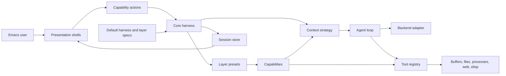
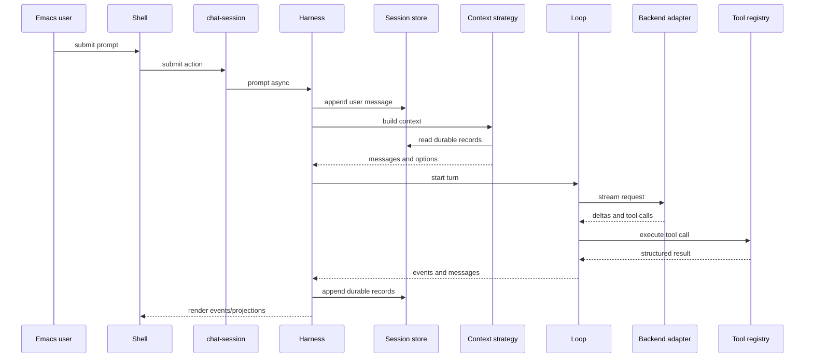

# Architecture

## Project Overview

`e` is an Emacs-hosted agent runtime. Its purpose is to let agents run inside
Emacs, inspect editor and project state, use explicit tools, and, when a
capability allows it, modify buffers, files, or runtime configuration.

The repository currently contains a usable chat-oriented runtime path: package
startup, a provider-neutral harness core, JSONL-backed session persistence,
capability-owned behavior bundles, layer presets, context assembly, a turn loop,
resource-operation tools, OpenAI-like backend adapters, presentation shells, live
reload support, and ERT coverage. Durable user data is primarily session state
under the user's Emacs directory plus optional project-local capability
configuration.

The architectural direction is capability-first. The harness owns lifecycle and
runtime records, capabilities own named behavior contracts, layers package those
capabilities, backend adapters own provider details, and shells own Emacs
interaction mechanics.

## Table Of Contents

- project overview: L3-L21
- architecture overview: L36-L80
- boundaries and invariants: L81-L116
- repository mapping: L117-L149
- components: L150-L348
- data and control flow: L349-L401
- public surfaces: L402-L432
- extension points: L433-L444
- testing and verification: L445-L463
- change management: L464-L470
- architecture discussion: L471-L512

## Architecture Overview

The normal runtime path starts in `e.el`. Package startup extends `load-path`,
loads the pure core, loads defaults, loads presentation shells, and then runs
startup hooks. Defaults register known layer specs and a lazy `:chat-default`
harness factory. Shells register manifests against the generic shell registry.

The harness is the stable application service. It creates sessions, tracks
active turns, stores explicit enabled layer ids and intrinsic capabilities,
derives fresh effective capabilities for each session root, builds
provider-neutral context, dispatches a backend turn through the loop, executes
tools, persists durable records, and publishes events for presentation shells.



The major runtime parts are:

- Core substrate: `e-core`, harness, sessions, context, events, resources, hooks,
  tools, compaction, stores, and startup hooks.
- Capability system: behavior contracts that contribute instructions, context
  providers, tools, resources, hooks, actions, and configuration options.
- Layer system: immutable registered presets over capability sets, defaults, and
  presentation shell manifests.
- Defaults: lazy harness factories and built-in layer specs.
- Backend adapters: OpenAI-like provider profiles, request mapping, auth, SSE
  parsing, timeout, and cancellation mechanics.
- Presentation shells: chat, global starter, canvas, and layer-selection command
  surfaces over harness and capability APIs.
- Test/development support: Eldev/ERT tests and live Emacs reload helpers.

## Boundaries And Invariants

Confirmed current boundaries:

- `lisp/core/e-core.el` loads only core runtime modules. It does not load
  presentation shells, default harness factories, concrete provider adapters, or
  layer implementation modules.
- `e.el` is the package entry point. It loads core, defaults, shell modules, and
  runs startup hooks, so package startup is intentionally broader than `e-core`.
- `AGENTS.md` is the local architecture policy source. This document is the
  current-state navigation map and review artifact.
- Sessions are the durable runtime source of truth for messages, activity
  events, session events, turn options, branch summaries, compactions, metadata,
  and current branch state.
- Buffers, files, processes, browser sessions, and provider connections remain
  external state. Capabilities expose them through resources and tools rather
  than making the harness own them.

Invariants that should keep holding:

- Harness code must stay independent from buffers, windows, keymaps, rendering,
  provider auth, and concrete side effects.
- Presentation shells host commands, keymaps, rendering, and Emacs interaction;
  they must not own provider routing, session semantics, tool execution, or
  durable runtime state.
- Capabilities define semantic behavior. Layers activate capability sets but
  should not own behavior or durable state.
- Provider request shapes, auth files, headers, wire APIs, retries, streaming,
  timeouts, and cancellation handles belong in backend adapters.
- Context strategies build provider-neutral model input. They should not know
  about UI rendering or provider-specific payloads.
- Side effects cross the core boundary through resource methods, model-facing
  tools, backend adapters, or presentation commands.
- Expected domain errors should be handled where the owner has enough context;
  unexpected errors should surface to the caller or shell.

## Repository Mapping

- `AGENTS.md`: durable project direction, architecture constraints, interactive
  development rules, and review questions.
- `README.org`: compact current architecture overview for users and maintainers.
- `docs/architecture.md`: this current-state architecture map.
- `docs/arch-align.md`: completed capability-first alignment plan and remaining
  direction reference.
- `docs/core.md`, `docs/M2.md`, `docs/mvp.md`, and matching `*-qa.md` files:
  historical implementation and QA maps for delivered slices.
- `docs/feats/`, `docs/bugs/`, and `docs/research/`: tracked work packages,
  bug investigations, and research notes using repo-local conventions.
- `e.el`: package entry point, load-path setup, package startup, public smoke
  command, and `e-dev-reload` autoload.
- `lisp/core/`: provider-neutral runtime substrate. This area owns contracts and
  orchestration, and must stay free of presentation, defaults, and provider auth.
- `lisp/defaults/`: built-in layer specs and lazy default harness assembly.
- `lisp/layers/`: capability and layer implementations for base OS tools, live
  Emacs tools, harness support, agent context, evidence retrieval, web access,
  text-editing guidance, chat-session actions, and layer selection.
- `lisp/adapters/openai/`: OpenAI-like backend adapter and provider profiles.
- `lisp/shells/`: presentation shell manifests, commands, keymaps, buffers, and
  rendering.
- `lisp/dev/`: live Emacs reload helpers for interactive development.
- `test/`: ERT coverage for core contracts, adapters, layers, tools, sessions,
  defaults, and shells.
- `Eldev`: Eldev configuration over the built-in ERT test runner.

Dependency direction should remain visible in this layout: shells/defaults/adapters
depend on core contracts; core contracts do not depend on shells/defaults/adapters.
Layer directories may contain concrete tools because those tools are owned by the
capability vocabulary that activates them.

## Components

### Core Entry And Startup

`e.el` owns package-level startup. It adds source subdirectories to `load-path`,
requires the pure core, loads defaults and shell modules, runs `e-startup-run`,
defines `e-version`, exposes `e-status`, and autoloads `e-dev-reload`.

`lisp/core/e-startup.el` owns the two startup hooks: `e-startup-layer-hook` and
`e-startup-shell-hook`. Defaults register layer and harness specs on the layer
hook; shells register manifests and refresh shell state on the shell hook.

This split keeps the core loadable without provider or presentation code while
still allowing the package entry point to assemble a normal user-facing runtime.

### Core Harness

`lisp/core/e-harness.el` is the main application service. It owns harness
construction, active layer state, active-turn tracking, capability-derived tool,
hook, store, and resource registries, session creation, event subscription,
runtime event emission, context preparation, compaction, prompt submission,
follow-up, abort, wait, reset, model/effort session options, and public session
projections.

The harness depends on core contracts: sessions, context strategies, tools,
resources, hooks, capability config, layers, backend, loop, and stores. It does
not know which shell requested a turn or which provider backs the LLM. Its side
effects are delegated to session stores, backend request handles, tool request
handles, and resource/tool implementations.

Important source paths:

- `lisp/core/e-harness.el`
- `lisp/core/e-harness-registry.el`
- `lisp/defaults/e-default-harnesses.el`
- `test/e-harness-test.el`
- `test/e-harness-registry-test.el`
- `test/e-defaults-test.el`

### Sessions And Durable State

`lisp/core/e-session.el` owns durable runtime records. It supports in-memory
stores and persistent stores rooted at `(locate-user-emacs-file "e/sessions/")`.
Persistent sessions append JSONL records under `sessions/<id>.jsonl` and maintain
an `index.json` for recent-session metadata. The index can be loaded eagerly
while individual session transcripts are loaded on demand by
`e-session-load-session`.

Session records include `session`, `message`, `activity-event`, `session-info`,
`messages-cleared`, `branch-summary`, `compaction`, and `current-branch`. Session
identity uses generated ids and per-entry identity/parent links. Display titles
prefer explicit names, then first user-message summaries, then untitled
timestamps.

Durable state follows a stability gradient. Stable session identity and config
persist as typed session metadata. Transcript, replay, compaction, provider
anchor, and audit evidence persist as append-only records. Current-state
references persist only the stable handle needed to rebuild live context.
Capability-owned state persists under owner-keyed capability state. Active
runtime state, presentation state, focus, point, overlays, read markers, timers,
request handles, retry counters, and rebuildable caches stay in the harness,
shell, buffer, or request that owns them.

`e-session` owns the durable metadata schema and typed write paths for session
config, current-state references, and capability state. Generic metadata writes
remain a compatibility path and must reject unowned, presentation-only, or
volatile state. Shells and layers can own presentation or live context, but they
should persist only stable references or explicit user intent.

The store is append-only evidence plus derived mutable projections. Future
semantic state artifacts such as canvas revisions should not be hidden inside a
presentation shell; they should be session records or separate resources with
session-linked provenance.

### Capabilities, Resources, Hooks, And Tools

`lisp/core/e-capabilities.el` defines behavior contracts. A capability can
contribute instructions, context providers, model-facing tools, resource methods,
read-only `e://` resources, lifecycle hooks, shell-facing actions, configuration
options, and capability-local defaults.

Shell-facing actions are semantic operations for presentation shells and host
Elisp. `e-actions-call` resolves an active capability action from the current
harness/session context, validates descriptor-required arguments, injects
harness/session state, and calls the action. Agents use it from `run_elisp`;
actions do not get a separate generic model-facing tool.

Resource operations are generic contracts over URI schemes. `e-resources`
registers methods for operations such as `read`, `write`, and `edit`; the
harness exposes a model-facing operation tool only when active capabilities
provide at least one method for that operation. `e-store` exposes read-only
capability resources under `e://<capability>/<path>`.

`e-tools` owns backend-neutral function definitions, async tool execution,
request handles, structured tool results, and resource-usage metadata. Tool
lifecycle hooks are registered by capabilities through `e-hooks`, then invoked
by the harness around tool execution. Unexpected hook errors fail the turn rather
than silently removing protection.

Important source paths:

- `lisp/core/e-capabilities.el`
- `lisp/core/e-actions.el`
- `lisp/core/e-resources.el`
- `lisp/core/e-store.el`
- `lisp/core/e-tools.el`
- `lisp/core/e-hooks.el`
- `lisp/core/e-operations.el`
- `test/e-capabilities-test.el`
- `test/e-tools-test.el`
- `test/e-resources-test.el`

### Layers And Defaults

Layers are stateless presets over capabilities. `lisp/layers/e-layers.el` owns
known layer specs and factory resolution. `lisp/defaults/e-default-layers.el`
registers built-in specs for `e`, `e-dev`, `agents-std-context`, `harness-base`,
`os-base`, `emacs-base`, `web`, `text-editing`, `org-canvas`, and
`project-local`. Each registered spec is a lazy `(:id :name :summary :feature
:factory)` record; the layer's concrete feature module is required only when the
layer is actually created.

`lisp/defaults/e-default-harnesses.el` registers the lazy `:chat-default` harness
factory. The default chat harness uses the Anthropic Messages provider path,
persistent sessions, intrinsic `chat-session` capabilities, and default layer
ids from `e-default-chat-layer-ids`. Runtime layer enable/disable operations
mutate only the harness `enabled-layer-ids` list; effective layers and
capabilities are rebuilt from registered layer specs using the session project
root. The default harness sync path records explicit ids back to
`e-default-chat-layer-ids` and rebuilds layer-owned presentation shells.

#### Default Chat Layer Set

`e-default-chat-layer-ids` is the source-of-truth preset attached to the default
chat harness. It enables these registered layers in order:

```
agents-std-context  harness-base  e  os-base  emacs-base
web  text-editing  org-canvas  project-local
```

The default chat harness additionally installs non-registered internal
`chat-session` capabilities in its intrinsic capability set. They are always
recreated by the factory/sync path and are excluded from the recorded
`e-default-chat-layer-ids`.

#### Registered Layers And Their Capabilities

| Layer (`:id`) | Name | In default chat set | Capabilities defined (`:id`) |
| --- | --- | --- | --- |
| `e` | e | yes | `e-runtime-context`, `layer-selection`, `context-inspection`, `session-compaction` |
| `e-dev` | e Dev | no | `context-inspection` |
| `agents-std-context` | Agents Std Context | yes | `agents-std-context` |
| `harness-base` | Harness Base | yes | `harness-base-context`, `session-tmp-resources`, `tool-output-truncation` |
| `os-base` | OS Base | yes | `base-guidance`, `file-handling`, `shell-process`, `output-style` |
| `emacs-base` | Emacs Base | yes | `emacs-awareness`, `buffer-read`, `selection-context`, `buffer-edit`, `elisp-eval` |
| `web` | Web | yes | `web` (Web Access) |
| `text-editing` | Text Editing | yes | `annotations`, plus `annotation-tools` when the annotation backend is available |
| `org-canvas` | Org Canvas | yes | `org-canvas` |
| `project-local` | Project Local | yes | aggregate: discovered project `.e/layers/` capabilities plus a project guidance capability (varies per repository) |
| `chat-session` | Chat Session | intrinsic only | `chat-session` |

The `e` layer is where runtime self-management lives: layer selection, context
inspection, runtime context, and the `session-compaction` action. `harness-base`
supplies harness-owned support (the `tmp://` resources and tool-output
truncation guards) and is not optional user-facing behavior. `os-base` and
`emacs-base` are the execution surfaces (workspace files/shell and live Emacs
buffers/elisp). `project-local` is an aggregate layer whose capabilities are
discovered from the project root, so its concrete capability set is
repository-dependent rather than fixed.

#### Capabilities In Support And Self-Management Layers

The main support/execution layers are defined in
`lisp/layers/harness/e-harness-base.el`, `lisp/layers/base/e-base.el`,
`lisp/layers/emacs/e-emacs-base.el`, and `lisp/layers/e-layer.el`. What each of
their capabilities actually contributes:

| Layer | Capability (`:id`) | Contributes |
| --- | --- | --- |
| `harness-base` | `harness-base-context` | Instructions only (priority 240): the reasoning-message guidance. No tools/resources. |
| `harness-base` | `session-tmp-resources` | Resource methods for the `tmp://` scheme (session-scoped read/write/edit of temporary text resources). |
| `harness-base` | `tool-output-truncation` | A `:post-tool-call` hook (`50-tool-output-truncation`) that replaces oversized tool output with a bounded preview plus metadata. |
| `os-base` | `base-guidance` | Instructions only (priority 230): use workspace file/shell tools; never traverse outside the project. No tools/resources. |
| `os-base` | `file-handling` | `resource_sync_status` tool + read/write/edit `file://` resource methods, scoped to workspace roots. |
| `os-base` | `shell-process` | The `bash` tool, rooted at the workspace directory. |
| `os-base` | `output-style` | Instructions only (priority 260): the active output style's prose, configured via `e-capability-config` (`:style`). Inert when no style is selected. No tools/resources. |
| `emacs-base` | `emacs-awareness` | Instructions (priority 300) + a context provider injecting visible-buffer context. No tools. |
| `emacs-base` | `buffer-read` | `list_buffers` tool + read-only `buffer://` resource method. |
| `emacs-base` | `selection-context` | Nothing yet — placeholder capability reserved for future selection context. |
| `emacs-base` | `buffer-edit` | `save_buffer` tool + writable `buffer://` resource method (live buffer mutation). |
| `emacs-base` | `elisp-eval` | The `run_elisp` tool for explicit Emacs Lisp evaluation, with context-bound `e-tools-call` and `e-actions-call` guidance. |
| `e` | `session-compaction` | Action `:compact` for active-turn context compaction. |

The contribution shape is consistent across the three layers: `*-context` /
`*-guidance` / `*-awareness` capabilities carry only instructions or a read-only
context provider; the remaining capabilities each own one cohesive
tool-and/or-resource surface (file I/O, shell, buffer I/O, elisp). `harness-base`
is the only one of the three that contributes a lifecycle hook, and
`selection-context` is an intentional empty placeholder.

The layer-selection capability and shell provide operator commands for enabling,
disabling, and toggling registered layers without making the chat shell own
layer state. Selection list entries report both `:enabled` (explicitly present
in `enabled-layer-ids`) and `:active` (present in the dependency-expanded
effective layer ids). Disabling an enabled layer that remains required removes
only the explicit id; it stays active through dependency closure.

### Context And Compaction

`lisp/core/e-context.el` owns provider-neutral context assembly. The current
strategy is `transcript-stack`, which builds messages from compacted session
state and prepends capability-provided context/instructions by priority.

`lisp/core/e-compaction.el` prepares compaction boundaries and summary prompts.
`e-harness-compact-session` runs a model-backed compaction, appends a compaction
record, and emits session events. `e-chat-session` exposes compaction as a
capability action and `e-chat` hosts it as a shell command.

Context providers are read-only. They may inspect session state, active
attachments, visible buffers, AGENTS/skill files, or resources, but they should
not perform provider-specific request shaping or concrete side effects.

### Agent Loop And Backend Adapter

`lisp/core/e-loop.el` owns one turn. It receives backend-neutral messages, tools,
options, and callbacks; streams assistant deltas and tool calls; executes tools;
feeds tool results back into the message list; re-queries the backend when
function calls require follow-up; and emits lifecycle events to the harness.

`lisp/core/e-backend.el` defines synchronous and asynchronous backend contracts
plus cancellable request handles. The OpenAI adapter in `lisp/adapters/openai/`
implements provider profiles, model/reasoning defaults, Codex auth-file loading,
token-auth profiles, Responses and Chat Completions request mapping, SSE parsing,
HTTP timeouts, raw diagnostics, and cancellable `url-retrieve` requests. Injected
request functions remain queued-only cancellable test seams.

Adding a provider should be an adapter change. It should not require changing
the chat shell, session store, or harness lifecycle policy.

### Execution Capabilities

The base OS capabilities live under `lisp/layers/base/`. `os-base` packages
`base-guidance`, `file-handling`, `shell-process`, and `output-style`.
`file://` read/write/edit methods enforce the resource operation contracts.
The `bash` tool runs process commands and streams output through a file-backed
collector so large output can be represented by bounded previews plus `tmp://`
resources when harness support is active.

The Emacs capabilities live under `lisp/layers/emacs/`. `emacs-base` packages
awareness, buffer read/edit resources, elisp evaluation, and selection context.
`buffer://` methods mutate live buffers; `save_buffer` is the explicit action
that persists file-backed buffer contents.

Harness support capabilities live under `lisp/layers/harness/`. They own
session-scoped `tmp://` resources and tool-output truncation hooks.

Optional capability layers include:

- `agents-std-context`: AGENTS.md and configured filesystem skill context plus
  skill resources.
- `e`: runtime self-management commands such as layer selection and context
  inspection.
- `web`: `web_search`, `web_fetch`, `web_browser`, and web reference resources.
- `text-editing`: progressive guidance resources for Simply Annotate workflows.
- `evidence-retrieval`: read-only tools for durable session messages, activity
  events, and individual tool results.

### Presentation Shells

`lisp/shells/e-shells.el` defines the shell manifest registry. A manifest names
a shell id, metadata, required/optional capabilities, commands, and keymaps. The
registry is intentionally narrow: it is discovery, not a shell lifecycle or
dependency-resolution framework.

Current shells:

- `e-chat`: session chat buffer, composer, rendering, block navigation, tool
  output views, context preview, compaction command, overview/sidebar, resume,
  switch, rename, model/effort commands, abort/reset, and source-reference
  capture. It requires `chat-session` and talks to the harness through public
  APIs and capability actions.
- `e-chat-starter`: global one-shot contextual prompt shell over a chat session.
- `e-canvas`: commands that create or attach live buffer/file context as
  `chat-session` attachments, including a primary canvas attachment.
- `e-layers-shell`: operator commands for known layer selection.

Shell instances are implementation details. `e-chat` uses buffer-local state,
markers, overlays, timers, and subscriptions to render a session, but those are
not generic runtime state and should not become semantic owners.

### Live Development

`lisp/dev/e-dev.el` owns live reload support for this repository. Repo policy
requires runtime-affecting changes to be reloaded into the user's running Emacs
with `e-dev-reload` when available, then inspected with focused live probes.

This reload helper is developer support rather than runtime policy. It is loaded
through `e.el` and autoloaded for interactive use, not through the pure core.

## Data And Control Flow

Normal chat turn:



Abort flow cancels what the harness currently owns. A queued turn cancels its
timer; an active backend/tool request is asked to cancel through its request
handle; an open tool call receives a durable cancelled tool result; the turn
emits `turn-cancelled`.

Layer selection flow stays outside presentation semantics. A shell command calls
the `layer-selection` capability action, which updates explicit enabled layer
ids on the target harness. The default harness sync path records changes back to
`e-default-chat-layer-ids` for the default chat harness and separately rebuilds
layer-owned shell registrations. Model-facing tools, resources, prompts, hooks,
stores, and context use fresh effective capabilities derived from the session
project root, not from shell sync state.

Live context attachment flow is durable current-state references, not transcript
history. Canvas or file/buffer attachments are stored under the `chat-session`
owner in session context references, and the `chat-session` context provider
reads current live content on each turn. Unsaved live buffer contents win over
disk reads.

Tool output protection flow runs through hooks. Tool results are normalized into
one structured result shape, post-tool hooks can replace large content with
bounded previews and `tmp://` references, and durable activity payloads are
compacted before being emitted and persisted.

## Public Surfaces

The main public surfaces are:

- Package entry: `(require 'e)`, `e-version`, `e-status`, and `e-dev-reload`.
- Harness API: `e-harness-create`, session creation/list/projection accessors,
  prompt/follow-up/abort/wait/reset/compact operations, model/effort session
  options, layer activation, and event subscription.
- Harness registry: named live harness instances and lazy factories through
  `e-harness-registry-*`.
- Session API: session creation, append/load/list, metadata, turn options,
  branch summaries, compactions, current branch, and display titles.
- Capability API: `e-capability-create`, contribution accessors, contribution
  registration helpers, actions, config options, and skill construction helpers.
- Resource/tool API: `e-operation-*`, `e-resources-*`, `e-store-*`,
  `e-tools-*`, and `e-session-tmp-*`.
- Layer API: layer specs, layer creation from registered specs, default layer
  registration, id-based harness enable/disable/effective queries, and
  layer-selection actions.
- Backend API: `e-backend-*`, `e-openai-backend-create`,
  `e-openai-create-harness`, and Codex compatibility wrappers.
- Shell API: `e-shell-*`, `e-chat-shell`, `e-chat-starter-shell`,
  `e-canvas-shell`, and `e-layers-shell`.
- Interactive commands: chat session creation/resume/switch/overview/sidebar,
  prompt submission, abort/reset, rename, model/effort, context preview,
  compaction, response/block/tool-output navigation, canvas attachment, global
  starter, and layer enable/disable/toggle.

Exhaustive function inventories should stay in source and tests. Architecture
depends on the ownership of these surfaces, not on duplicating every command name
here.

## Extension Points

Established extension points are backend adapters, OpenAI-like provider profiles,
context strategies, context providers, capabilities, layer presets, resource
operation methods, `e://` resources, lifecycle hooks, model-facing tools,
session stores, startup hooks, and presentation shell manifests.

Inferred but not yet mature extension points are richer context-state strategies,
permission/audit policy, harness self-modification tools, and generic shell
instance lifecycle. They should not receive broad abstractions until a second
real implementation gives the contract stable semantics.

## Testing And Verification

The project uses Eldev with Emacs' built-in ERT runner. The current tree has
focused tests for package exposure, events, sessions, backend contracts, OpenAI
mapping, context construction, compaction, capabilities, capability config,
resources, stores, hooks, tools, base/Emacs/web/evidence capabilities, layers,
defaults, harness behavior, registry behavior, loop behavior, chat-session
actions, chat presentation, starter/canvas shells, and development reload.

Core behavior is testable with fake backends, injected transports, in-memory
stores, temporary persistent stores, fake tools, and capability fixtures. Adapter
tests cover provider request/stream mapping and concrete side effects. Shell
tests should keep proving command wiring and rendering against harness events
rather than reimplementing harness tests.

Runtime-facing changes still require live Emacs reload and focused live probes
because batch-green Emacs Lisp does not prove the user's current Emacs process
has the new definitions.

## Change Management

Update this document when any of these move: core/presentation boundary, default
harness assembly, layer/capability ownership, context strategy contract, session
record schema, tool lifecycle semantics, backend adapter contract, resource URI
semantics, shell manifest shape, or public harness/session command surface.

## Architecture Discussion

Against the repo guidance, the current architecture is mostly aligned with the
target decomposition:

- Ownership is clear in the main path. Harness owns lifecycle and runtime
  records; sessions own durable state; capabilities own behavior; layers package
  capabilities; adapters own provider and side-effect details; shells own Emacs
  presentation.
- Dependency direction is mostly correct. Core modules depend on stable local
  contracts, while defaults, shells, layer implementations, and OpenAI adapters
  depend outward on core contracts.
- Side effects are largely outside the core. File, buffer, shell, web, elisp, and
  provider operations sit behind tools/adapters/resource methods. Session
  persistence is the core's intentional durable side effect.
- Interfaces are now semantically real. The backend, session, tool, resource,
  hook, capability, layer, context, harness, and shell-manifest contracts each
  have current consumers and tests.

Confirmed gaps:

- Permission and audit policy are named in the architecture but not implemented
  as a first-class capability/tool gate.
- Canvas support is currently live context attachment plus shell commands, not a
  separate versioned canvas-state context strategy.
- Harness self-modification is still architectural direction, not an exposed
  tool surface.
- Shell manifests are discovery records only. Generic shell lifecycle,
  capability matching, and shell-to-shell handoff are intentionally absent.
- The synchronous backend helper still publishes a non-cancellable request
  marker; the normal async `url-retrieve` path returns a cancellable request.

Delta to the architectural vision:

- The project has moved from scaffold toward a working capability-first runtime.
  The OpenAI/Codex path, persistent sessions, context strategy, tool lifecycle,
  default harness, shell manifests, live context attachments, web/text-editing
  layers, and cancellation hooks are implemented.
- The remaining vision work is not more generic structure by default. It is
  concrete policy and state work: permission/audit records, richer context-state
  artifacts, explicit self-modification tools, and only then broader shell
  lifecycle semantics if multiple shells require the same contract.
