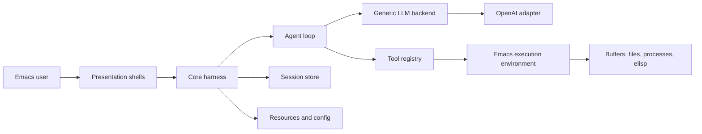
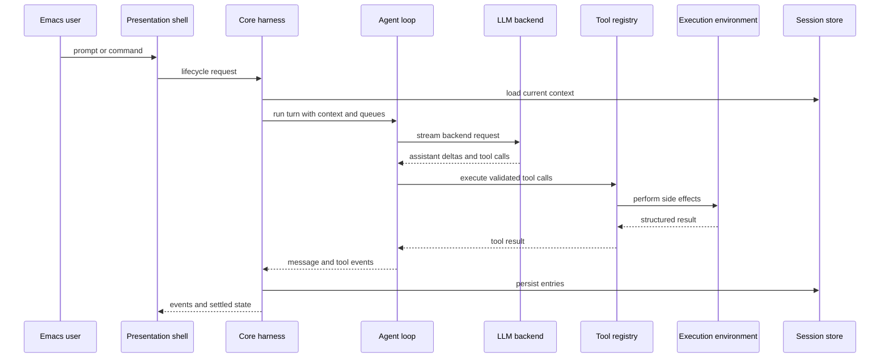

# Architecture

## Project Overview

`e` is an Emacs-hosted agent runtime inspired by pi-core. It should let Emacs run live-configurable agents that can inspect editor state, operate tools, and, when explicitly authorized, modify Emacs configuration or their own harnesses.

The repository currently contains only `AGENTS.md` and this document. The architecture below is therefore a target-state overview for the core harness surface, not a description of implemented source modules.

The primary runtime surfaces are expected to be an Emacs Lisp harness API, Emacs presentation shells, explicit tool adapters, session persistence, and generic LLM backend adapters. The first provider target is OpenAI API access through ChatGPT subscription auth, but provider details must remain outside core harness policy.

## Architecture Overview

The central architecture is a stable harness core with replaceable shells around it. Presentation code renders state and submits user intent. The harness owns agent lifecycle, durable session state, model selection, tool execution, event emission, and backend dispatch. Side effects cross through explicit adapters.

The target shape is:

- Core harness: lifecycle, state, queues, events, tools, resources, and session coordination.
- Agent loop: context transformation, model streaming, tool-call handling, and stop conditions.
- Execution environment: Emacs-aware side-effect boundary for buffers, files, processes, elisp evaluation, and harness mutation tools.
- LLM backend: generic provider interface with OpenAI/ChatGPT auth as the first adapter.
- Presentation shells: Emacs buffers, commands, keymaps, and interaction modes that consume harness events.
- Persistence: durable sessions, compaction records, branch summaries, and configuration state.

## Boundaries And Invariants

Confirmed current state:

- No implementation modules exist yet.
- `AGENTS.md` is the current architecture policy source of truth.
- This document records the target architecture and must be updated when source modules are introduced.

Target invariants:

- Harness code must not depend on presentation buffers, window layout, keymaps, or rendering details.
- Presentation shells may depend on harness APIs and events, but must not own agent policy, backend routing, session semantics, or tool execution semantics.
- LLM provider specifics belong in backend adapters. The core harness depends on a generic backend contract, not OpenAI-specific auth or payload shapes.
- OpenAI API access through ChatGPT subscription auth is an adapter concern. Auth refresh, provider headers, and model capability mapping stay outside the core loop.
- Emacs side effects belong in the execution environment and concrete tools. The core harness describes intent and consumes results.
- Harness self-modification must be exposed as explicit tools with recorded effects, not implicit mutation from presentation code.
- Expected domain errors are handled where the layer has enough context; unexpected errors surface to the top-level shell.

## Repository Mapping

Current repository mapping:

- `AGENTS.md`: durable repo guidance, architectural constraints, and design self-check questions.
- `docs/architecture.md`: current architecture map and target-state description.

No source directories exist yet. When implementation begins, this section should be updated before the document is treated as current-state architecture.

Expected future mapping should keep these roles separate:

- Harness modules: no presentation dependencies, no provider-specific auth, no direct UI side effects.
- Presentation modules: Emacs UI commands and rendering only; depend inward on harness APIs.
- Backend adapters: provider-specific auth, request mapping, streaming, and model capability translation.
- Execution adapters and tools: side effects against Emacs, files, processes, and harness mutation capabilities.
- Session storage: durable messages, branches, compaction, summaries, and metadata.
- Tests: fake backends and fake execution environments for core behavior; adapter tests for concrete side effects.

## Components

### Core Harness Surface

The core harness owns the stable application boundary for agents. It should provide lifecycle operations such as prompt, continue, steer, follow-up, abort, wait, and reset without exposing presentation details.

It owns current agent state, structured events, queue state, active tools, resources, session coordination, and delegation to the agent loop. It collaborates with the session store, generic backend interface, tool registry, and execution environment. Its side effects should be limited to adapter calls for backend streaming, session persistence, and tool execution.

No source paths implement this component yet.

### Agent Loop

The agent loop owns turn execution. It transforms harness context into backend-ready messages, streams assistant output, processes tool calls, applies stop conditions, and reports lifecycle/tool/message events back to the harness.

The loop depends on generic contracts supplied by the harness. It should not know which presentation shell requested the turn or which provider implements the backend.

### Session And State Store

The session store owns durable conversation state. The target model should support more than a flat transcript because agents need resumable work, compaction, branch summaries, and explicit metadata changes.

The store should persist user, assistant, tool-result, and custom harness messages; track model and thinking-level changes; represent compaction and branch summaries; and expose a current leaf or branch cursor for resume and navigation. Presentation shells may display this state but must not become its source of truth.

### Execution Environment And Tools

The execution environment is the shell boundary for Emacs side effects. It should expose narrow capabilities for reading buffers, editing buffers, writing files, running processes, evaluating elisp, and modifying harness-owned configuration or code when explicit tools allow it.

Tools depend on the execution environment. The core harness depends only on tool contracts and structured tool results. Permission checks, confirmation, observability, and audit records should stay close to concrete side effects.

### LLM Backend Interface

The LLM backend interface owns provider independence. The first adapter should target OpenAI API access through ChatGPT subscription auth, but the harness should treat it as one backend implementation.

The interface should accept backend-neutral messages/options, stream assistant output and tool-call requests, map model capabilities outside core policy, and isolate auth, retry, headers, and provider-specific request/response shapes. Adding a second provider should require a new adapter, not changes to presentation shells or core harness policy.

### Presentation Shells

Presentation shells are Emacs-facing UI layers. They render sessions, messages, tool progress, errors, and queue state; provide commands and keymaps; and let users inspect or authorize sensitive side effects.

Presentation shells must not own session semantics, provider routing, tool policy, backend-specific auth, or harness lifecycle behavior.

## Data And Control Flow

Normal prompt flow:

Configuration flow should follow the same boundary. Presentation submits a configuration intent to the harness. The harness updates stable state or delegates side effects to adapters. Provider-specific configuration is stored behind backend adapter configuration, not in generic harness state.

## Public Surfaces

There are no implemented public APIs yet.

The target public surface should be an Emacs Lisp harness API rather than a UI-only command set. It should cover lifecycle operations, state access, event subscription, backend and tool configuration, session selection, and adapter registration.

Presentation commands should call this surface instead of duplicating behavior.

## Extension Points

Established extension points do not exist yet in code. Target extension points are LLM backend adapters, tool definitions, execution environment adapters, resource providers, session repositories, and presentation shells.

These are architectural seams because they protect stable harness policy from volatile UI, provider, and side-effect details.

## Testing And Verification

No tests exist yet.

The first implementation should make the core harness testable with fake backends, fake tools, fake execution environments, and in-memory sessions. Those tests should prove lifecycle, event ordering, queue handling, session writes, tool-result handling, and provider independence without launching a full Emacs presentation shell.

Adapter tests should separately verify Emacs side effects, provider auth, and provider streaming behavior. Presentation tests should verify command wiring and rendering against harness events, not duplicate harness behavior.

## Change Management

Update this document when the harness/presentation boundary moves, the LLM backend contract changes, the session storage format changes, tool execution semantics change, Emacs side-effect boundaries move, or public harness lifecycle/event surfaces are renamed or removed.

## Architecture Discussion

The target architecture gives each behavior a clear owner: the harness owns lifecycle and policy, the loop owns turn execution, the session store owns durable state, adapters own side effects and provider specifics, and presentation owns interaction.

Dependency direction should flow from unstable code toward stable contracts. Presentation, provider adapters, and concrete tools are expected to change more often than core harness policy, so they should depend on the harness surface rather than the reverse.

Side effects are intentionally pushed outward. Buffer edits, file writes, process execution, elisp evaluation, provider auth, and harness self-modification all belong behind explicit adapters or tools. This keeps the core loop testable with fake implementations.

The main abstraction risk is creating generic interfaces before their semantics are real. The harness, backend, tool, session, and execution environment contracts are justified because the project already has explicit change pressure in those dimensions: multiple presentations, provider independence, live-configurable tools, durable sessions, and Emacs-native side effects.

Confirmed gap: there is no implementation yet. The current architecture is a vision recorded in durable docs, not a verified code map.

Delta to the architectural vision:

- Source modules need to establish the harness surface before presentation work grows around it.
- A fake backend and in-memory session store should exist before the OpenAI/ChatGPT adapter so backend independence is tested early.
- Presentation should start as a thin shell over harness events, not as the place where lifecycle behavior accumulates.
- Self-modifying agent capabilities need explicit tools, session records, and permission behavior before they are exposed through UI commands.
