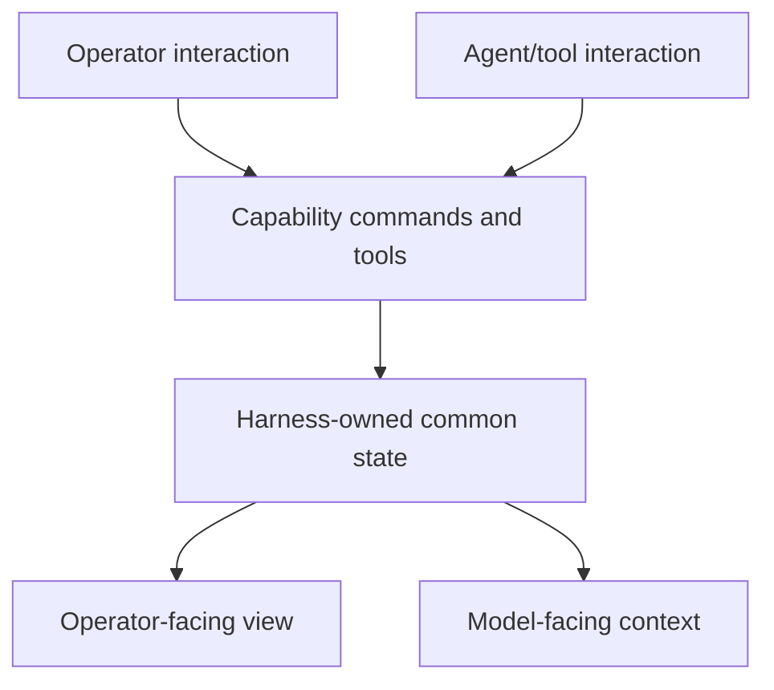
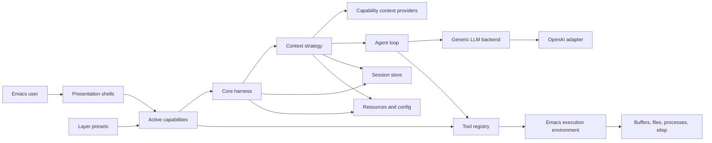
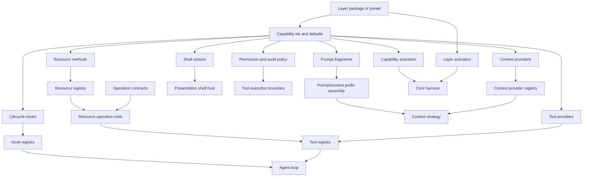
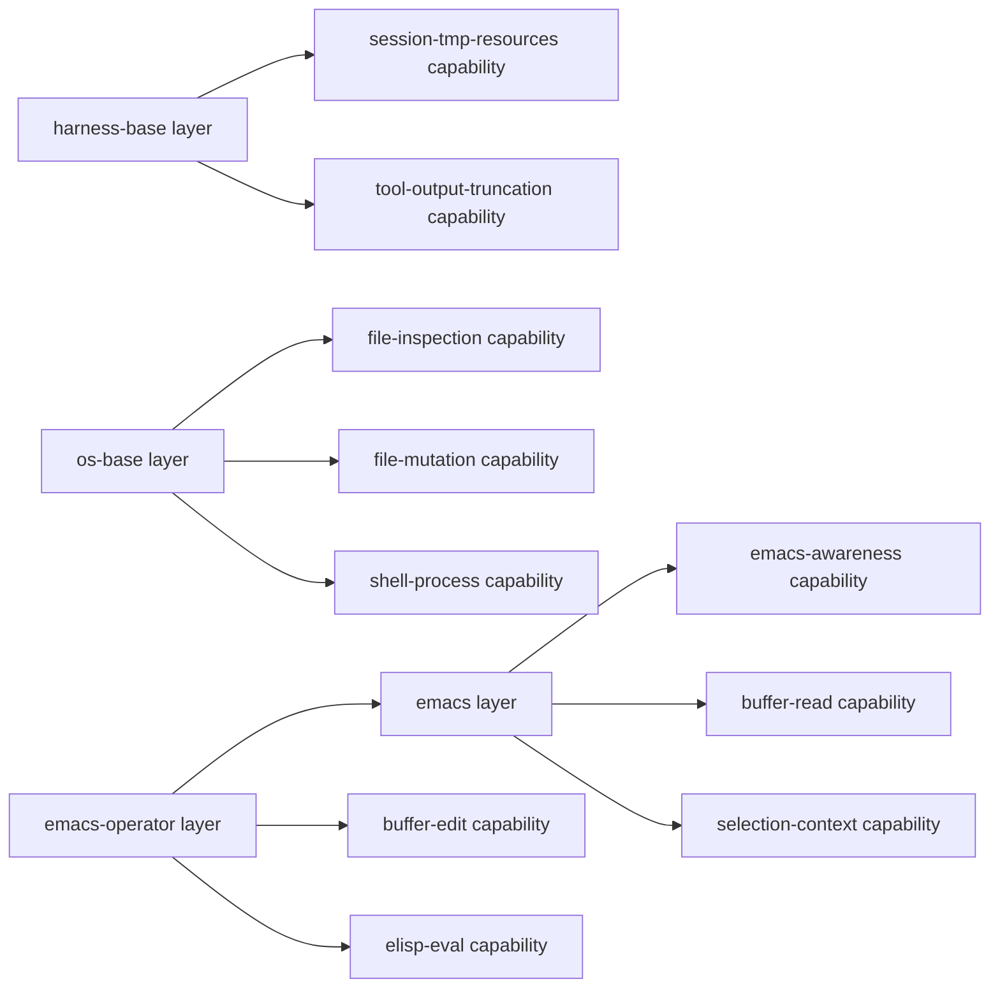
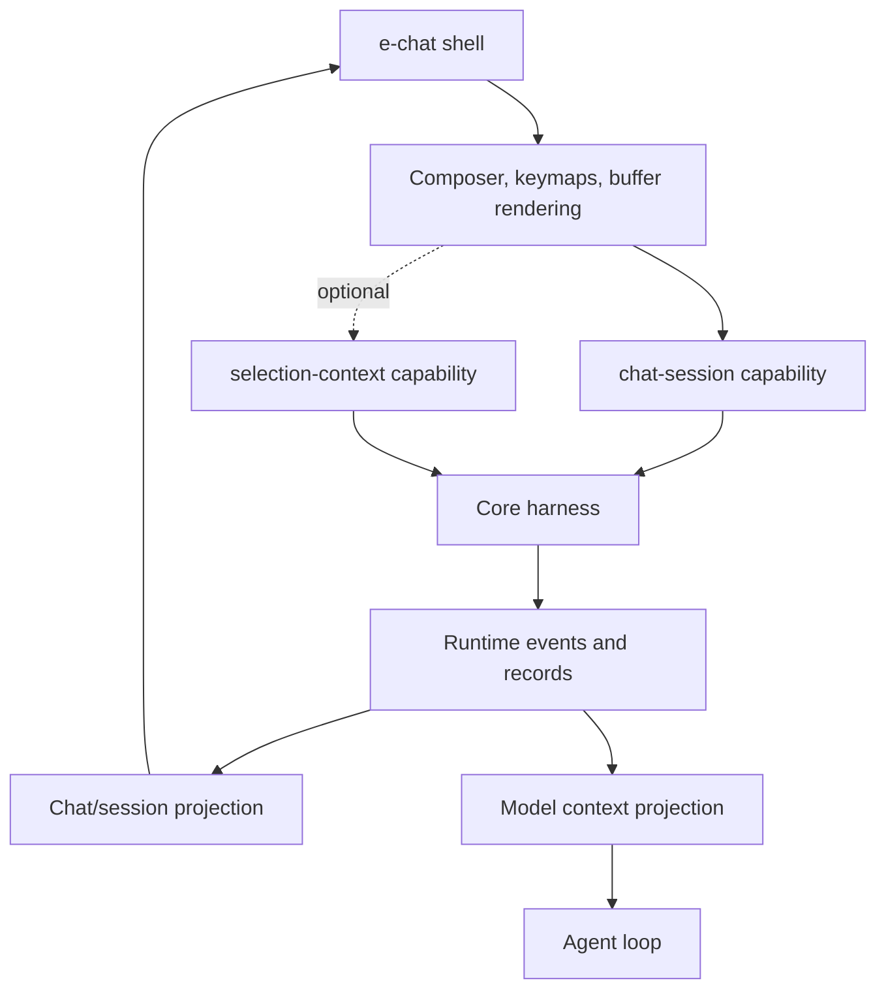
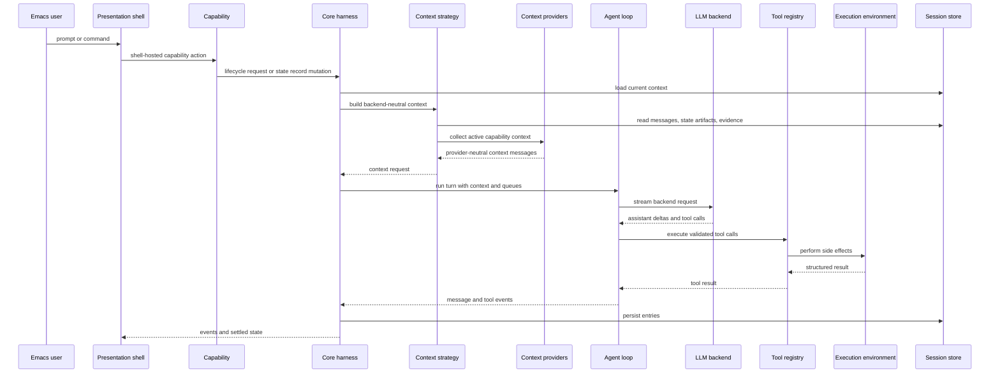

# Architecture

## Project Overview

`e` is an Emacs-hosted agent runtime inspired by pi-core. It should let Emacs run live-configurable agents that can inspect editor state, operate tools, and, when explicitly authorized, modify Emacs configuration or their own harnesses.

The repository now contains the first usable Emacs-hosted agent path. The package entry point, event helpers, JSONL-backed persistent session store, context strategy seam, capability-backed layer presets, backend-neutral adapter contract, profile-configurable OpenAI-like Responses adapter, tool registry, Emacs base layer, buffer and elisp tools, loop, harness service, async turn settlement and cancellation hooks, basic chat presentation, development reload helper, and ERT tests exist. The architecture below still includes target-state components that have not been implemented yet, especially richer context management, permission controls, and harness self-modification tools.

The primary runtime surfaces are expected to be an Emacs Lisp harness API, capability contracts, layer presets, context-management strategies, Emacs presentation shells, explicit tool adapters, session persistence, and generic LLM backend adapters. The first provider target is OpenAI API access through ChatGPT subscription auth, but provider details must remain outside core harness policy.

## Table Of Contents

- project overview: L3-L10
- architecture overview: L25-L74
- boundaries and invariants: L75-L99
- repository mapping: L100-L143
- components: L144-L305
- data and control flow: L306-L347
- public surfaces: L348-L371
- extension points: L372-L377
- testing and verification: L378-L385
- change management: L386-L389
- architecture discussion: L390-L409

## Architecture Overview

The central architecture is a stable harness core with replaceable capabilities, layers, and shells around it. The harness is the common runtime substrate: it owns lifecycle, durable session records, turns, messages, resources, command/event ordering, model selection, tool execution, and backend dispatch. Capabilities are the semantic behavior contracts: they define model-facing tools, context providers, prompt fragments, shell-facing actions, and side-effect policy for a specific behavior. Layers are packaging units or presets that activate a coherent set of capabilities. Shells are human interaction adapters over active capabilities: they bind keys, collect Emacs interaction facts, render projections, and avoid becoming the semantic source of truth.

The target interaction model is a shared state and operation path with different consumers:

The LLM-facing representation is a projection, not the storage model. Most models consume textual messages plus structured tool definitions, but the harness should keep richer generic records where needed: session entries, turn records, messages, resources, context entries, and events. A layer should not own behavior or durable state. If a capability needs durable data, it should express that data as generic harness/session records or references to external Emacs/file state, and then provide context providers or tools that interpret those records.

The target shape is:

- Core harness: lifecycle, state, queues, events, tools, resources, and session coordination.
- Agent loop: context transformation, model streaming, tool-call handling, and stop conditions.
- Capabilities: behavior contracts that contribute context providers, prompt fragments, model tools, shell actions, schemas, and side-effect policy without owning durable state.
- Layers: packaging units and presets that activate capability sets with optional defaults.
- Context management: strategy-selected construction of backend context from session state, prompts, tool results, resources, active capability contributions, and optional explicit state artifacts.
- Execution environment: Emacs-aware side-effect boundary for buffers, files, processes, elisp evaluation, and harness mutation tools.
- LLM backend: generic provider interface with OpenAI/ChatGPT auth as the first adapter.
- Presentation shells: Emacs buffers, commands, keymaps, and interaction modes that host capability actions and render harness/capability/layer projections.
- Persistence: durable sessions, compaction records, branch summaries, and configuration state.

## Boundaries And Invariants

Confirmed current state:

- A package entry point, pure core harness modules, OpenAI/Codex adapter, development reload helper, and ERT test suite exist.
- The current loop supports fake and Codex-backed flows with in-memory or persisted sessions, structured events, tool calls, and narrow async turn settlement.
- `AGENTS.md` is the current architecture policy source of truth.
- This document records the current architecture and target seams, and must be updated as runtime components replace deferred behavior.

Target invariants:

- Harness code must not depend on presentation buffers, window layout, keymaps, or rendering details.
- Presentation shells should not become owners of runtime state. They may host interaction mechanics and render projections, but semantic state transitions should converge on capability actions and harness-owned records as soon as practical.
- Capabilities should not depend on presentation shells. Capabilities may contribute shell-facing actions, but shell-specific rendering and keymaps stay in shells.
- Layers should package capabilities, not own behavior directly. A layer can name capabilities, defaults, and presets, but the behavior contract belongs to the capability.
- Capabilities and layers should not own durable state in the near-term architecture. Durable capability-relevant data should be represented as generic harness/session records, resources, messages, or references to external Emacs/file state.
- LLM provider specifics belong in backend adapters. The core harness depends on a generic backend contract, not OpenAI-specific auth or payload shapes.
- OpenAI API access through ChatGPT subscription auth is an adapter concern. Auth refresh, provider headers, and model capability mapping stay outside the core loop.
- Context construction must remain provider-neutral. The OpenAI backend should receive backend-neutral messages, tools, and options, not own transcript replay, compaction, or canvas-state policy.
- Context management is strategy-selectable. The first strategy is classic transcript stack replay; the architecture must also allow explicit state-artifact strategies such as canvas mode.
- Emacs side effects belong in the execution environment and concrete tools. The core harness describes intent and consumes results.
- Harness self-modification must be exposed as explicit tools with recorded effects, not implicit mutation from presentation code.
- Append-only evidence logs and mutable semantic state must stay distinct when a context strategy uses explicit state artifacts.
- Expected domain errors are handled where the capability has enough context; unexpected errors surface to the top-level shell.

## Repository Mapping

Current repository mapping:

- `AGENTS.md`: durable repo guidance, architectural constraints, and design self-check questions.
- `docs/architecture.md`: current architecture map and target-state description.
- `docs/core.md`: completed implementation plan for the first pure core harness.
- `docs/core-qa.md`: QA scenario map for the completed core slices.
- `docs/M2.md`: completed implementation plan for making the core use a real Codex backend path.
- `docs/M2-qa.md`: QA scenario map for the completed M2 slices.
- `docs/mvp.md`: completed MVP implementation plan for chat, layers, visible-buffer context, and Emacs tools.
- `docs/feat-canvas.md`: deferred design note for canvas-state context management.
- `e.el`: package entry point, public smoke commands, package metadata, and autoloads.
- `lisp/core/`: core harness/runtime contracts, including module aggregation, events, sessions, context strategy, backend contract, capability contract, hook registry, tool registry, turn loop, and harness service.
- `lisp/layers/e-layers.el`: harness-owned layer descriptor contract.
- `lisp/layers/harness/`: the `harness-base` layer preset, session-scoped `tmp://` resources, and tool-output context protection hooks.
- `lisp/layers/base/`: the `os-base` layer preset, its file/process capabilities, and the concrete file/shell tool modules those capabilities use.
- `lisp/layers/emacs/`: the `emacs-base` layer preset, its Emacs awareness/buffer/elisp capabilities, and the concrete Emacs buffer/elisp tool modules those capabilities use.
- `lisp/layers/chat/`: the `chat-session` capability actions hosted by chat presentation shells.
- `lisp/layers/evidence/`: the read-only session evidence retrieval capability and tools.
- `lisp/defaults/`: startup harness specs and default harness factories. It registers named lazy harness factories such as `:chat-default` without making presentation shells own provider or layer assembly.
- `lisp/shells/e-shells.el`: first-class presentation shell manifest structs and the in-process discovery registry.
- `lisp/shells/chat/`: basic chat presentation buffer, commands, keymap, and harness event rendering.
- `lisp/adapters/openai/`: profile-configurable OpenAI-like Responses adapter for Codex auth, token-auth gateways, request mapping, and SSE parsing.
- `lisp/dev/`: interactive development helpers for live reloading local source in Emacs.
- `test/e-test.el`: ERT smoke tests for the package surface and exposed harness API.
- `test/e-*-test.el`: focused ERT tests for events, sessions, backend contract, layers, Emacs base, tools, loop, harness behavior, and chat presentation.
- `Eldev`: Eldev test/build/lint/package tooling configuration.

The source tree should keep architecture visible:

- Harness modules: common runtime substrate, no presentation dependencies, no provider-specific auth, no direct UI side effects.
- Layer directories: each layer directory contains the layer preset plus the capabilities and concrete tool modules primarily composed by that layer.
- Capability modules: package behavior contracts; depend on harness/layer/tool/context contracts, not shells. Do not move a capability to a shared top-level location until a second real layer uses the same semantic contract.
- Context strategy modules: provider-neutral context assembly and interpretation of context-state outputs.
- Presentation modules: Emacs UI commands, interaction adapters, manifests, and rendering only; host capabilities instead of owning semantic state.
- Backend adapters: provider-specific auth, request mapping, streaming, and model capability translation.
- Execution adapters and tools: side effects against Emacs, files, processes, and harness mutation capabilities; keep layer-local tool modules next to the capabilities that use them unless reuse proves otherwise.
- Session storage: durable messages, branches, compaction, summaries, and metadata.
- Tests: fake backends and fake execution environments for core behavior; adapter tests for concrete side effects.

## Components

### Core Harness Surface

The core harness owns the stable application boundary for agents. It should provide lifecycle operations such as prompt, continue, steer, follow-up, abort, wait, and reset without exposing presentation details.

It owns current runtime state, structured events, queue state, active tools, resources, session coordination, and delegation to the agent loop. It collaborates with the session store, generic backend interface, capability and layer registries, tool registry, and execution environment. Its side effects should be limited to adapter calls for backend streaming, session persistence, and tool execution.

Current code exposes `e-harness-create`, `e-harness-create-session`, `e-harness-subscribe`, `e-harness-activate-layer`, `e-harness-prompt`, `e-harness-prompt-async`, `e-harness-wait`, `e-harness-follow-up`, `e-harness-abort`, `e-harness-reset`, `e-harness-state`, `e-harness-messages`, and public session projection accessors through `(require 'e)`. The implementation supports in-memory and persistent session stores, narrow async settlement, active layer registration, and context-provider prefix messages. It is sufficient for fake-backend tests, a real Codex-backed prompt path, resume-capable chat presentation, but it does not yet support interrupting an already-running provider call inside Emacs.

The harness is the source of truth for runtime ordering and durable records, not for every semantic object in the system. External buffers and files remain authoritative for their live content. Capabilities define how selected harness records or external references are projected into model context, but they should not keep an independent durable state store.

### Capabilities And Layers

Capabilities are the behavior units. A capability can contribute instructions, prompt fragments, context providers, model-facing tool registration, in-memory `e://` resources, resource methods, lifecycle hooks, shell-facing actions, schemas, side-effect policy, and capability-scoped configuration metadata for one named behavior. These contributions are registered into explicit harness registries; the harness should not treat a capability as an opaque object that handles every concern through one callback.

Layers are packaging units. A layer names a coherent capability set and optional defaults so users, shells, or profiles can activate useful behavior without manually selecting every capability. A layer may remain a convenience preset such as `os-base` or `emacs-base`, but the behavior contract should still live in capabilities such as `file-inspection`, `buffer-read`, or `elisp-eval`.

Capability configuration is scoped by capability id through `e-capability-config`. Option declarations belong to the capability owner, while global and directory-local values are resolved when a configured capability is constructed. Layers may pass a project directory or package defaults into a capability factory, but layers stay stateless presets rather than runtime configuration owners. Unknown option keys for an active capability are errors so project-local typos surface where the capability has enough context to validate them.

The near-term rule is that capabilities and layers are stateless with respect to durable state. They may keep ephemeral caches or helper functions, but any state that must survive, be observed by multiple shells, or be used by both the operator and the agent should live as harness/session records or as external Emacs/file state referenced by harness records.

Capability contribution types should stay separate even when they ship together:

- context providers: read harness/session records or external state and produce backend-neutral context messages
- tool providers: register model-facing tools with explicit argument/result shapes
- in-memory resources: register read-only capability-scoped entries under `e://<capability>/<path>`; skill builder resources conventionally live under `skills/<skill-name>` and references under `refs/<reference-name>.md`
- resource methods: implement operation contracts such as `read`, `write`, and `edit` for URI schemes such as `file://` and `buffer://`
- lifecycle hooks: named functions at hook points such as `:pre-tool-call` and `:post-tool-call`; hooks at a point run by lexicographical hook id order
- prompt fragments: add model guidance that belongs with a capability
- shell actions: expose operator-facing operations that shells can host
- permission and audit policy: describe expected approval and evidence records for side-effecting operations
- layer presets: activate a useful collection of capability ids and defaults

This lets a coherent capability package keep its vocabulary together without forcing every layer to be bidirectional. A capability that only adds prompt guidance should not need tool or command hooks. A capability that adds Emacs buffer behavior may contribute context providers, model tools, and shell actions because they share the same source vocabulary. A layer then becomes a packaging decision over those capabilities, not a semantic owner.

The `harness-base` layer is a harness-support preset, not an OS or editor tool layer. It contributes session-scoped temporary resources and a post-tool-call truncation hook. `tmp://` resources are ephemeral to a harness session; model-facing `read` can load the full content while ordinary transcript/tool-result context only receives the bounded preview. The default output guard exposes at most 50 kB or 2000 logical lines and records truncation metadata with the full-output URI.

The `os-base` layer is a workspace-oriented preset over smaller capabilities: `base-guidance`, `file-inspection`, `file-mutation`, and `shell-process`. Those capabilities differ in side effects and dependencies, so they should not be treated as one behavior boundary merely because one layer activates them together. The `bash` tool uses a file-backed streaming collector for stdout/stderr so large or failing commands do not first accumulate as an unbounded Emacs buffer/string; with `harness-base` active, the full stream is spooled to `tmp://`.

The `emacs-base` layer is also a preset rather than an atomic behavior unit. Its implementation composes smaller capabilities:

- `emacs-awareness`: Emacs-specific instructions and visible-buffer metadata/context
- `buffer-read`: buffer listing and read-only `buffer://` resource semantics
- `buffer-edit`: writable `buffer://` resource semantics and explicit buffer saves
- `elisp-eval`: explicit elisp evaluation
- `selection-context`: explicit context entries for selected regions or buffer ranges

After such a split, `emacs` can remain as a convenient layer over a conservative subset, while a more capable `emacs-operator` layer can opt into editing and elisp evaluation.

### Agent Loop

The agent loop owns turn execution. It accepts backend-ready messages, streams assistant output, processes tool calls, applies stop conditions, and reports lifecycle/tool/message events back to the harness.

The loop depends on generic contracts supplied by the harness. It should not know which presentation shell requested the turn or which provider implements the backend.

The current loop in `lisp/core/e-loop.el` is backend-neutral. It consumes backend stream items, appends assistant and tool-result messages through callbacks, emits structured events, and can re-query the backend after tool results so function-call flows can settle with an assistant message. It does not accumulate policy for how context is assembled; that belongs in a context-management strategy.

### Context Management Strategies

Context management owns the transformation from durable session state and current turn inputs into backend-ready context. It is a strategy seam between the harness/session store and the loop/backend. Context providers are read-only contributors supplied by active capabilities; the harness collects provider messages and prepends them through the context strategy entry point.

The first real strategy is `transcript-stack`: replay prior user, assistant, and tool-result messages into the model request. This is the simplest path for making the OpenAI backend work.

The architecture must also allow alternative strategies, especially `canvas-state` as described in `docs/feat-canvas.md`. In canvas mode, a durable canvas is the authoritative semantic state, while the full transcript and tool results remain append-only evidence retrievable through tools. The model receives the current canvas, the latest prompt, recent observations, and selected evidence; it can then request tool calls or propose a versioned canvas edit.

Context strategies should own:

- merging harness-provided prefix messages with the selected context shape
- invoking active capability context providers and preserving their backend-neutral output
- selecting and formatting session messages, tool results, resources, and evidence
- deciding whether the model sees a transcript stack, a canvas state document, or another context shape
- interpreting model outputs that update context-owned state artifacts
- preserving provenance links between summaries, facts, decisions, and evidence

Context strategies must not own provider auth, provider-specific payload mapping, UI rendering, or concrete Emacs side effects.

### Session And State Store

The session store owns durable conversation state. The target model should support more than a flat transcript because agents need resumable work, compaction, branch summaries, and explicit metadata changes.

The store should persist user, assistant, tool-result, and custom harness messages; track model and thinking-level changes; represent compaction and branch summaries; and expose a current leaf or branch cursor for resume and navigation. Presentation shells may display this state but must not become its source of truth.

The current store in `lisp/core/e-session.el` supports both in-memory stores and a default persistent store rooted at `(locate-user-emacs-file "e/sessions/")`. Persistent sessions use append-only JSONL files under `sessions/<id>.jsonl` for `session`, `message`, `session-info`, and `messages-cleared` records, plus `index.json` for recent-session completion metadata. The implemented display title policy is explicit manual name, first 25 characters of the first user-message fallback with `...` for longer prompts, then an untitled timestamp. Future context-state artifacts such as canvas revisions should remain separate from the append-only evidence log: logs are evidence, while canvas or summary documents are editable semantic state.

### Execution Environment, Resources, And Tools

The execution environment is the shell boundary for Emacs side effects. It should expose narrow capabilities for reading buffers, editing buffers, writing files, running processes, evaluating elisp, and modifying harness-owned configuration or code when explicit tools allow it.

Resources are the stable model-facing address space for inspectable and mutable state. Operation contracts define shared model-facing tools such as `read`, `write`, and `edit`; capabilities contribute resource methods that implement those contracts for URI schemes. The model-facing `write` contract is invariant across writable schemes: write complete content, create missing parent paths and target resources inside the method's allowed scope, or overwrite existing content. The harness exposes an operation tool only when the active capabilities register at least one method for that operation. The core also provides a read-only in-memory `e://` resource method when active capabilities contribute store entries. Capability-owned resources live under `e://<capability>/<path>`; by convention skill builder resources are stored under `e://<capability>/skills/<skill-name>` and references under `e://<capability>/refs/<reference-name>.md`. A skill spec is construction sugar that appends compact references to the capability's normal instructions and registers full guidance as ordinary read-only `e://` resources. The harness does not scan for skills or inject a separate skill catalog; progressive discovery flows through capability instructions plus the existing `read` tool. Reference resources remain discoverable through their URIs but are not injected into context as full content unless read through the normal tool-result transcript path. `file-inspection` contributes read-only `file://` methods, `file-mutation` contributes writable `file://` methods, `buffer-read` contributes read-only `buffer://` methods, and `buffer-edit` contributes writable `buffer://` methods. Range addressing is structured tool input rather than URI syntax, so a model calls `read` with a URI plus a range object such as `(:unit "line" :start 10 :end 20)` or `(:unit "offset" :start 2001 :limit 2000)`.

Tools depend on the execution environment. The core harness depends only on tool contracts, backend-neutral tool definitions, resource registry dispatch, and structured tool results. Permission checks, confirmation, observability, and audit records should stay close to concrete side effects.

The current concrete model-facing tool surface is a stable resource operation family, `read`, `write`, and `edit`, plus capability-specific operational tools such as `list_buffers`, `save_buffer`, `run_elisp`, and `bash`. Buffer write/edit resources mutate live buffers without saving; `save_buffer` is the explicit persistence action for file-backed buffers. Process execution, permission/confirmation controls, and harness mutation remain separate from the resource abstraction.

In the capability vision, tools are not the same thing as operator commands. A model-facing tool and a shell-facing command may converge on the same underlying capability operation, but they keep separate public shapes. Tools are compact, explicit, schema-driven model affordances. Shell commands are interactive operator affordances that can read current Emacs interaction facts before invoking a shared operation or storing a harness record.

### LLM Backend Interface

The LLM backend interface owns provider independence. The first adapter targets OpenAI/Codex access through ChatGPT subscription auth, but the harness treats it as one backend implementation.

The interface should accept backend-neutral messages/options, stream assistant output and tool-call requests, map model capabilities outside core policy, and isolate auth, retry, headers, and provider-specific request/response shapes. Adding a second provider should require a new adapter, not changes to presentation shells or core harness policy.

The OpenAI adapter uses provider profiles as adapter-local configuration. Codex profiles resolve `auth.json`, extract the access token and ChatGPT account id, build a ChatGPT Codex Responses request, and parse SSE output into backend-neutral stream items. Token-auth OpenAI-like profiles read a bearer token from a configured environment variable and send only standard Responses headers. It does not decide whether a session uses transcript-stack context, canvas-state context, or another future strategy.

### Presentation Shells

Presentation shells are Emacs-facing UI layers. They render sessions, messages, tool progress, errors, and queue state; provide commands and keymaps; and let users inspect or authorize sensitive side effects.

Presentation shells must not own session semantics, provider routing, backend-specific auth, or harness lifecycle behavior. Their durable input and output should converge on harness records and capability actions instead of creating parallel shell-only state.

Shells now also publish first-class manifests through `e-shells`. A shell manifest is a discovery contract for a shell id, human-readable metadata, required and optional capabilities, operator commands, and keymaps. The registry is intentionally narrow: it supports in-process discovery and replacement by shell id, but it does not define lifecycle, instances, surfaces, origins, dependency resolution, command argument schemas, or shell-to-shell handoff.

The current presentation shell is `e-chat`: a basic session-specific chat buffer with prompt submission, event rendering, reset, abort, new-session, resume, and rename commands. It publishes an `e-chat-shell` manifest registered under `chat`, requests its configured harness id from the harness registry, requires an active `chat-session` capability, and renders harness/session projections through public harness APIs. Tests register fake harnesses or factories under the configured id so UI behavior stays independent of provider details.

In the target shape, `e-chat` should become a host for a `chat-session` capability rather than a privileged harness client. It will still render buffers, manage keymaps, collect composer text, and display events, but the semantic actions should be exposed by that capability: submit message, abort turn, reset session, select model, inspect context, and manage attachments. That likely means the chat shell will require at least the `chat-session` capability, and can optionally host capabilities such as `selection-context` when those capabilities are active through a layer or direct activation.

Live harness selection goes through `e-harness-registry`, a core service for named harness instances and lazy harness factories. The registry only maps ids to concrete harnesses or factories; it does not do property matching, choose global defaults, or interpret capability configuration. Startup configuration in `lisp/defaults/e-default-harnesses.el` currently registers one lazy spec, `:chat-default`, whose factory creates the OpenAI-backed chat harness, attaches the persistent session store, and activates `chat-session`, `agents-std-context`, `harness-base`, `e`, `os-base`, and `emacs-base`. Capability activation and configuration are per harness. Sessions store durable conversation state plus narrow session overrides or later requirements; sessions do not own capability activation.

Shell instances remain implementation details. `e-chat` currently represents live chat state with buffer-local variables, markers, timers, overlays, and harness subscriptions; that runtime shape is not part of the generic shell interface until multiple shells prove a shared instance protocol is real.

## Data And Control Flow

Normal prompt flow:

Configuration flow should follow the same boundary. Presentation submits an interaction to a capability action. The capability action records generic runtime state through the harness or delegates concrete side effects to tools/adapters. Provider-specific configuration is stored behind backend adapter configuration, not in generic harness state.

Tool calls flow through a harness-owned lifecycle adapter. Pre-tool hooks run before a tool call is appended or executed, and post-tool hooks run before the result is appended, emitted, persisted, or sent back to the backend. Unexpected hook errors fail the turn instead of silently removing protection. Structured tool-result content is serialized through one shared provider-visible text path before truncation decisions are made.

Canvas-state flow is a specialized context-management flow. The context strategy reads the current canvas revision and selected evidence, the loop receives backend-neutral context, and accepted canvas edits are validated and persisted as new revisions. The raw log remains append-only evidence.

## Public Surfaces

The current public package surface is:

- `(require 'e)`: load the package.
- `e-version`: current package version.
- `e-status`: interactive smoke command that reports the loaded package status.
- `e-chat-new`: interactive command that creates and opens a new persisted chat session.
- `e-chat-resume`: interactive command that resumes a recent persisted chat session.
- `e-chat-rename`: interactive command that manually renames the current chat session.
- `e-chat-set-model` and `e-chat-set-effort`: interactive commands that update session-scoped model options.
- `e-dev-reload`: interactive development command that reloads local source files.
- `e-harness-create`, `e-harness-create-session`, `e-harness-subscribe`, `e-harness-activate-layer`, `e-harness-prompt`, `e-harness-prompt-async`, `e-harness-wait`, `e-harness-follow-up`, `e-harness-abort`, `e-harness-reset`, `e-harness-state`, `e-harness-messages`, `e-harness-session-title`, `e-harness-session-name`, `e-harness-session-list`, `e-harness-session-activity-events`, and `e-harness-turn-options`: core harness API and session projection surface.
- `e-harness-registry-register-factory`, `e-harness-registry-register`, `e-harness-registry-get`, `e-harness-registry-get-or-create`, `e-harness-registry-list`, and `e-harness-registry-clear-instance`: named live harness lookup and lazy factory registration.
- `e-default-harnesses-register`, `e-default-chat-harness-create`, and `e-default-session-store`: default startup harness spec registration and default chat harness assembly for the `:chat-default` path.
- `e-operation-create`, `e-operation-read`, `e-operation-write`, `e-operation-edit`, `e-resources-registry-create`, `e-resource-method-create`, `e-resources-register`, `e-resources-call`, `e-resources-read`, `e-resources-write`, `e-resources-edit`, `e-resources-operations`, and `e-resources-methods-for-operation`: core URI resource operation registry and method surface.
- `e-hook-create`, `e-hooks-registry-create`, `e-hooks-register`, `e-hooks-for-point`, and `e-hooks-run-reduce`: capability hook registration and ordered hook execution.
- `e-tools-current-context`, `e-tools-result-create`, and `e-tools-result-p`: tool implementation helpers for context-aware starts and structured results with metadata.
- `e-store-create`, `e-store-register`, `e-store-uri`, `e-store-read`, `e-store-list`, and `e-store-resource-method`: capability-scoped read-only in-memory resources exposed through `e://`.
- `e-session-tmp-write` and `e-session-tmp-file-path`: session-scoped temporary output helpers used by context-protection tools and `tmp://` resource methods.
- `e-capability-config`, `e-capability-config-option-create`, `e-capability-config-resolve`, `e-capability-config-customize`, and `e-capability-config-describe`: capability-owned option declarations plus global and directory-local configuration resolution.
- `e-skill-spec-create`, `e-capability-with-skills-create`, and `e-skills-uri-for-name`: construction-time skill specs that build ordinary capabilities with compact instruction references and conventional `e://<capability>/skills/<skill-name>` resources; the harness does not consume a skill catalog.
- `e-openai-create-harness`: create a harness configured for `e-openai-default-provider` or an explicit OpenAI-like provider profile.
- `e-openai-backend-create`: create the concrete OpenAI-like Responses backend adapter.
- `e-openai-codex-create-harness`: compatibility wrapper for ChatGPT-backed Codex access.
- `e-openai-codex-backend-create`: compatibility wrapper for the concrete OpenAI/Codex backend adapter.
- `e-harness-base-layer-create`: create the harness support layer for `tmp://` resources and tool-output truncation.
- `e-base-layer-create`: create the OS file/shell layer.
- `e-emacs-base-layer-create`: create the default Emacs layer.
- `e-emacs-tools-register-buffer-read-resource`, `e-emacs-tools-register-buffer-resource`, and `e-emacs-tools-register-elisp-eval`: register focused concrete Emacs resource and tool groups used by capabilities.
- `e-shell-create`, `e-shell-command-create`, `e-shell-register`, `e-shell-get`, `e-shell-list`, and `e-shell-command-by-id`: generic shell manifest and discovery API.
- `e-chat-shell`: return the registered chat presentation shell manifest.

The target public surface should be an Emacs Lisp harness API rather than a UI-only command set. It should cover lifecycle operations, state access, event subscription, backend and tool configuration, session selection, and adapter registration.

Presentation commands should ultimately call capability-facing operations that use this harness surface instead of duplicating behavior or reaching into session internals directly.

## Extension Points

Established extension points now exist for backend adapters, OpenAI-like provider profiles, context-management strategies, context providers, harness-owned layers, pure tool definitions, `e://` resource providers, URI resource methods, operation contracts, concrete Emacs tool registration, and presentation shells. Target extension points are LLM backend adapters, context-management strategies, capability contribution bundles, layer presets, tool definitions, execution environment adapters, resource providers, session repositories, and presentation shells.

These are architectural seams because they keep the harness substrate separate from volatile UI, provider, context, and side-effect details.

## Testing And Verification

`test/e-test.el` contains ERT smoke tests for loading the package, exposing `e-version`, exposing the interactive status/chat/reload commands, and exposing the harness API. Eldev is the project test/build/lint/package runner.

The current implementation makes the core harness testable with fake backends, injected OpenAI/Codex transports, registered default harness factories, pure fake tools, concrete file and Emacs resource methods, concrete Emacs elisp tools, layer/context-provider fixtures, chat presentation fixtures, and in-memory or persisted sessions. Current tests prove event shape, session writes and replay, backend independence, context construction, layer activation, visible-buffer context, operation-method resource dispatch, file and buffer read/write/edit semantics, OpenAI/Codex request/stream mapping, default harness registration and assembly, tool-result handling, buffer save behavior, elisp evaluation, tool follow-up, async settlement, cancellation, lifecycle operations, chat rendering, resume and rename behavior, and package exposure. Future capability tests should prove each capability independently of the layer presets that activate it.

Adapter tests should separately verify Emacs side effects, provider auth, provider streaming behavior, and context strategy behavior. Presentation tests should verify command wiring and rendering against harness events, not duplicate harness behavior.

## Change Management

Update this document when the harness/presentation boundary moves, the context-management contract changes, the LLM backend contract changes, the session storage format changes, tool execution semantics change, Emacs side-effect boundaries move, or public harness lifecycle/event surfaces are renamed or removed.

## Architecture Discussion

The target architecture gives each behavior a clear owner: the harness owns lifecycle and common runtime records, capabilities own named behavior contracts, layers package capability sets, context strategies own backend context assembly, the loop owns turn execution, the session store owns durable state, adapters own side effects and provider specifics, and presentation shells own human interaction mechanics.

Dependency direction should flow from unstable code toward stable contracts. Presentation, provider adapters, capability bundles, layer presets, and concrete tools are expected to change more often than the core harness substrate, so they should depend on harness/capability/layer contracts rather than the reverse.

Side effects are intentionally pushed outward. Buffer edits, file writes, process execution, elisp evaluation, provider auth, and harness self-modification all belong behind explicit adapters or tools. This keeps the core loop testable with fake implementations.

The main abstraction risk is creating generic interfaces before their semantics are real. The harness, backend, tool, session, context-strategy, capability contribution, layer preset, and execution environment contracts are justified because the project already has explicit change pressure in those dimensions: multiple presentations, provider independence, live-configurable tools, durable sessions, alternative context formats, and Emacs-native side effects.

Confirmed gap: the implementation now has JSONL-backed persistent sessions and a basic presentation shell. It is no longer only a scaffold: real provider access, context strategy selection, capability-backed layer presets, the `emacs-base` tool surface, function-call follow-up, narrow async settlement, persistent chat sessions, resume, manual rename, branch/compaction records, evidence retrieval tools, and provider request cancellation hooks now exist. AI-generated titles, delete/branch navigation UI, richer presentation shells, canvas-state context, permission controls, and harness self-modification remain future work.

Delta to the architectural vision:

- The OpenAI/ChatGPT adapter now builds on the backend-neutral contract instead of changing harness policy.
- Context construction has been extracted as a strategy before transcript replay could be hard-coded into the OpenAI backend.
- Layers are harness-owned presets over capability modules; behavior contributions now live in capabilities rather than layer fields.
- Presentation shells now have minimal first-class manifests and a discovery registry, while live shell instances remain implementation details.
- The chat presentation starts as a thin shell over harness events, publishes the `chat` shell manifest, and delegates chat semantics through the `chat-session` capability. Further shells can host optional capabilities such as `selection-context`.
- Self-modifying agent capabilities need explicit tools and session records before they are exposed through UI commands.
- Canvas-state context management should remain deferred until the transcript-stack strategy and OpenAI backend are working, but `docs/feat-canvas.md` records the invariants the architecture should preserve.
