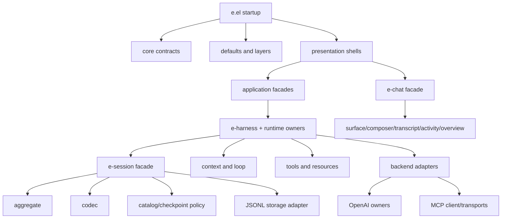
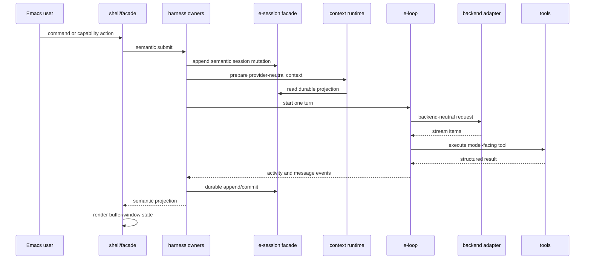

# Architecture

## Project Overview

`e` is an Emacs-hosted agent runtime. Agents run inside Emacs, inspect editor
and project state, use explicit tools, and can modify buffers, files, or runtime
configuration only when an active capability grants the relevant operation.

The current implementation is a capability-first runtime with stable
application facades: `e-harness` for lifecycle and turn policy, `e-session` for
durable session state, provider/MCP/base facades for external adapters, and
presentation shells such as `e-chat`. Facades compose owner modules; they do
not make one owner’s private state into a shared internal API. JSONL session
persistence, board routing, provider adapters, context lifetime, tools,
resources, hooks, and shell rendering are implemented. Feature 91's accepted
Round 1--4 boundaries are reflected in the source tree; the Round 5 audit
records the residual-topology and test-topology evidence for this map.

The durable vocabulary is defined by
[`runtime_concepts.org`](references/runtime_concepts.org). In this document,
a harness owns agent lifecycle and runtime policy, a session owns durable
conversation and session facts, a turn is one active model/tool interaction, a
capability contributes behavior, a layer packages capabilities, a tool is
model-facing, a resource method serves a URI operation, a context provider
supplies model context, a hook observes a lifecycle boundary, an action is a
shell-facing capability operation, a shell owns Emacs presentation, and a
backend adapter owns provider protocol and transport details.

## Table Of Contents

- [Project overview](#project-overview)
- [Architecture overview](#architecture-overview)
- [Boundaries and invariants](#boundaries-and-invariants)
- [Repository mapping](#repository-mapping)
- [Components](#components)
- [Data and control flow](#data-and-control-flow)
- [Public surfaces](#public-surfaces)
- [Extension points](#extension-points)
- [Testing and verification](#testing-and-verification)
- [Change management](#change-management)
- [Architecture discussion](#architecture-discussion)

## Architecture Overview

Package startup begins at `e.el`. It loads the provider-neutral core, registers
default harness/layer specifications, and registers shell manifests. A normal
turn flows from a presentation shell through a capability action or application
service into the harness, session/context/turn owners, and a backend adapter.
The result returns as durable session records and semantic activity projections;
shells render those projections into buffers.

```mermaid
flowchart TD
    Entry["e.el startup"] --> Core["core contracts"]
    Entry --> Defaults["defaults and layers"]
    Entry --> Shells["presentation shells"]
    Shells --> Facades["application facades"]
    Facades --> H["e-harness + runtime owners"]
    H --> S["e-session facade"]
    S --> SA["aggregate"]
    S --> SC["codec"]
    S --> SCat["catalog/checkpoint policy"]
    S --> SS["JSONL storage adapter"]
    H --> Ctx["context and loop"]
    H --> Tools["tools and resources"]
    H --> Backends["backend adapters"]
    Backends --> OpenAI["OpenAI owners"]
    Backends --> MCP["MCP client/transports"]
    Shells --> Chat["e-chat facade"]
    Chat --> Presentation["surface/composer/transcript/activity/overview"]
```

The runtime dependency direction is intentionally one-way within each family:

- Core contracts do not load presentation shells, default factories, or provider
  adapters.
- The `e-harness` facade composes state, capability, activity, turn-state,
  context-runtime, and turn owners. Those owners do not call `e-harness`.
- The `e-session` facade applies aggregate mutations and supplies explicit
  values to codec, catalog, and storage. Codec/catalog/storage do not mutate the
  aggregate or call the facade. Pure metadata, identity, provider-anchor, and
  board-routing policy values are owned by small session policy modules; the
  aggregate owns only loaded session state and semantic mutation/replay.
- The `e-chat` facade composes the five presentation owners. Component owners
  use only lower semantic presentation operations and do not call the facade.
- OpenAI, MCP, and base facades compose protocol/transport or file/process
  owners. Concrete transport state does not become policy state.

## Boundaries And Invariants

The following are current boundaries, not a future proposal:

- `lisp/core/e-core.el` remains loadable without defaults, provider adapters, or
  presentation shells. `e.el` is the broader package composition root.
- A session is the durable source of truth for messages, activity facts, session
  metadata, turn options, branch summaries, compaction records, context
  projections, and current branch state. Presentation buffers and provider
  connections are rebuildable runtime state.
- Each mutable cluster has one owner and an explicit lifetime. Process-local
  state belongs to the harness/board; durable state belongs to a session;
  request and transport state belongs to a Work/request or adapter; buffer-local
  state belongs to a shell owner.
- Harness code does not depend on buffers, windows, keymaps, rendering, or
  provider auth. Shells do not implement session mutation, provider routing,
  tool execution, or durable replay.
- Capability and layer code exposes semantic contributions. A layer is a
  stateless preset and is not a second owner of capability state.
- Provider request shapes, auth, retries, streaming, timeout, cancellation, and
  response diagnostics stay behind backend adapters. Context policy emits
  provider-neutral values.
- Session JSONL file names, record spellings, ordering, queued-write semantics,
  atomicity, retry behavior, recovery policy, and error conditions are current
  compatibility requirements. Feature 87's future SQLite/migration/cutover
  work remains Planned and is not implemented here.
- Expected domain errors are handled by the owner with enough context.
  Unexpected errors surface to the application service or shell.
- Core/session/harness/provider and record-shape changes require a full Emacs
  restart. Extension seams such as capability/layer definitions may use the
  repository reload path when explicitly requested; repository validation does
  not reload the user's running Emacs.

## Repository Mapping

- `AGENTS.md`: durable project direction, architecture constraints, interactive
  development policy, and design self-check questions.
- `README.org`: short user-facing architecture overview.
- `docs/architecture.md`: this current-state map.
- `docs/references/runtime_concepts.org`: terminology authority.
- `docs/references/dev_work.org`: work-package and evidence conventions.
- `docs/feats/91-improve-modularization/`: Feature 91 plan and round audits.
- `e.el`: package entry point, load paths, startup, version/status, and reload
  autoload.
- `lisp/core/`: provider-neutral runtime, session, board, context, tool,
  resource, hook, MCP, and harness contracts.
- `lisp/defaults/`: lazy default harness and layer assembly.
- `lisp/layers/`: capability implementations and layer presets.
- `lisp/adapters/openai/`: OpenAI facade and provider owners.
- `lisp/shells/`: shell manifests, commands, keymaps, buffers, and rendering.
- `lisp/dev/`: development, profiling, and batch-support code.
- `test/`: direct owner, mechanism, facade, restart, and integration tests.
- `e2e/`: isolated graphical and optional credentialed end-to-end scenarios.
- `Eldev`: project test and compilation configuration.

## Components

### Entry, contracts, capabilities, and layers

`e.el` owns package startup; `e-startup.el` owns startup hooks. Core contract
modules define capabilities, actions, resource methods, tools, hooks, Work
handles, requests, context providers, and backend requests. `e-layers.el` owns
registered layer specifications and lazy factory resolution. Defaults register
lazy `:chat-default` and `:debug-default` factories.

`lisp/core/e-capabilities.el`, `e-actions.el`, `e-resources.el`, `e-tools.el`,
`e-hooks.el`, `e-work.el`, `e-request.el`, `lisp/layers/e-layers.el`, and
`lisp/defaults/` are the primary paths. These modules hold contracts and
contribution policy; side effects are performed by the selected tool, resource
method, backend adapter, or shell command.

### Harness and runtime-control family

`lisp/core/e-harness.el` is the stable harness facade and composition authority.
Its owner modules are:

| Owner | Responsibility and state | Lifetime/side effects |
| --- | --- | --- |
| `e-harness-state.el` | Harness identity and explicit substates | Process-local harness lifetime; no external I/O |
| `e-harness-capabilities.el` | Effective layers, capabilities, tools, resources, hooks, prompts, and workspace derivation | Rebuilt per harness/session projection; loads layer factories |
| `e-harness-activity.el` | Activity classification, bounded projection, subscribers, durable activity append | Harness lifetime; appends through the session facade |
| `e-harness-turn-state.el` | Active-turn identity, prompt queue, steering/inbox and unsettled projections | Process-local turn/session lifetime; emits semantic activity |
| `e-harness-context-runtime.el` | Context providers, generational lifetime, anchors, compaction policy, prompt options | Turn/context lifetime; calls context, loop, and Work contracts |
| `e-harness-turn.el` | Submit, settle, retry, queue, attach, abort, reset, compact, and wait composition | Turn lifetime; owns provider/tool/request side effects at the application boundary |

No owner calls the facade or mutates a sibling's private representation. Board
attachment uses the explicit attached-turn port implemented by `e-harness-turn`;
`e-board-runtime` consumes only that port's authorization, submission,
steering, queue, abort, activity-observation, and final-output semantics.

### Session and durable storage family

`lisp/core/e-session.el` is the stable session application facade. The physical
and semantic owners are:

| Owner | Responsibility and state | Lifetime/side effects |
| --- | --- | --- |
| `e-session-aggregate.el` | Loaded session/domain aggregate, identity/path references and derived fields, board journal, semantic mutations and replay application | Session lifetime; no file, queue, controller, or storage calls |
| `e-session-metadata.el` | Durable metadata schema, classification, validation, and legacy normalization | Stateless value policy; no aggregate or persistence state |
| `e-session-identity.el` | Session/entry IDs, monotonic ULIDs, and legacy entry-ID backfill | Process-local identity generator; no aggregate mutation |
| `e-session-provider-anchor.el` | Provider-anchor compatibility over explicit path and fingerprint values | Stateless value policy; no aggregate or provider state |
| `e-session-board-policy.el` | Declarative routing-policy validation, copying, normalization, and size bounds | Stateless value policy; aggregate retains association/journal mutation |
| `e-session-codec.el` | Pure JSONL value/record encode, decode, normalization, and durable schema values | Stateless; no aggregate/store mutation |
| `e-session-catalog.el` | Bounded index/checkpoint projections and recovery policy over explicit values | Stateless/pure projection; no file or storage calls |
| `e-session-storage.el` | JSONL/index/checkpoint files, queue/controller/outbox, timers, atomic writes, retries, and adapter-owned state | Session-store lifetime; physical I/O and Node writer side effects |

The facade coordinates semantic mutations and storage commits with explicit
values. Aggregate replay applies decoded data; codec replay mapping itself is
pure. The policy owners return detached values and do not own aggregate
representation. The storage adapter sees an opaque owner key and semantic
records, not aggregate internals. Durable session and board-association
formats retain their existing ordering and restart behavior.

### Boards and retained core state machines

`lisp/core/e-board.el` is a cohesive process-local board state machine. One board
owns event sequence, participant admission, routing, pickup, publication,
subscriptions, processing records, activity, terminal classification, and
aggregation because those transitions share atomic admission and settlement
ordering. Splitting any one into a generic helper would either duplicate the
sequence/admission state or break the transaction boundary.

`e-board-runtime.el` is the board attachment adapter. It owns attachment
admission/reconciliation, endpoint generations, producer/activity mailboxes,
rebind/move/detach transitions, and delivery settlement because those values
must change atomically with board admission and attachment settlement. Board
routing/publication remains in `e-board`; harness execution remains behind the
attached-turn port. `e-board-registry.el`, `e-board-orchestration.el`, and
`e-board-orchestration-actions.el` provide narrower registry/application seams.
Terminal attachment cleanup has one explicit owner operation,
`e-board-runtime-retire-attachment`: it accepts the exact attachment object,
fences all board/participant and session/endpoint maps, settles that
attachment's FIFO/activity/invocation work, and retires its participant routes
through the registry owner. `e-chat-service` coordinates its presentation
clients and calls this operation; it never reaches into runtime maps. The
operation accepts a held board while active, closing, or closed, while durable
session/board association remains available for a later public re-ensure.
Retirement is staged: the exact runtime map triple remains authoritative while
the observer, attachment-local producer delivery/turn indexes, FIFO pickups,
activity mailboxes, invocations, and exact participant routes are settled. A
lower-owner error leaves the attachment in `retiring` with the same exact
authority, so a repeated call completes rather than falling back to an id-only
lookup. The retirement generation fences callbacks accepted before the
transition; Work activity capture checks the current active attachment before
mutating a mailbox, and a classifier page that arrives in the retirement
window can cancel only that attachment's ready pickup.
Pickup-drain callbacks also capture a runtime scheduler generation. Removing
one attachment's FIFO cells advances that generation, clears the scheduled
receipt, and schedules any surviving queue under a fresh receipt; an old
callback is therefore inert and cannot consume replacement work. Invocation
effects use the same terminal-owner rule: the exact invocation is removed and
accounted before fallible unsettled notifications, so a notification fault or
reentrant attachment retirement cannot double-decrement it.
Prepared Work admission is one staged runtime transaction.  The runtime first
installs its exact Work dispatcher/activity observers, then admits the exact
invocation target and unsettled-count token, and finally asks `e-board` to
commit the work/invocation relation.  `e-board-work-admission-token` is an
opaque board-owned inverse token: if a later step signals, the runtime passes
that token back to `e-board-abort-work-enrollment`, which removes only the
objects and event identities created by that attempt.  The inverse is
idempotent and leaves pre-existing or replacement targets/observers untouched;
the initiating error remains visible.  This process-local transaction does not
alter durable board formats or event ordering on successful admissions.
The board's event and work-index owners acquire exact cell receipts before
their first observable list, map, head, link, tail, or count mutation.  Each
receipt records object-identity neighbours and resumable forward/inverse
stages; inverses repair the captured successor and preserve monotonic event
sequence values without scanning or deleting an equal-key replacement.  The
same rule covers terminal-classifier and aggregation-deadline queues.  A
direct board API registers an unfinished admission in the board-local pending
catalog, while a runtime composition registers its opaque admission in a
runtime catalog indexed by exact source board and attachment.  Both catalogs
retain retry authority when a lower-owner inverse signals, and related new
mutations recover the captured token before proceeding.  Aggregation admission
tokens additionally capture the exact aggregation map, work indexes,
subscription event, classifier/deadline receipts, timer, and prepared
activation; runtime postchecks reject a reentrant or replacement-invalidated
lease and abort only that exact token.
Ordinary-route retirement is owned by `e-board-retire-subscription-exact` in
`e-board`: its board-monotonic lifetime token fences classifiers, prepared and
queued effects, replay snapshots, quiet/lifetime/expiry callbacks, and same-id
replacement routes. `e-board-registry-retire-participant-exact` delegates to
that operation before removing participant catalogs. The separate durable
`e-board-registry-remove-participant` path remains for the established
`participant-removed` event and inactive historical projection.
Deferred input classification carries an exact subscription object/token and
participant object from authorization through grouping, preparation, and the
final atomic pickup commit. A route changed at any of those boundaries fails
the whole frozen transaction; a committed pickup retains its participant
lifetime so runtime routing can settle stale producer work by delivery identity
without resolving a same-id replacement.
`e-board-message-envelope` is the board-owned detached journal projection, and
`e-chat-service-reconcile-board-continuation` is the chat-service application
operation that replays terminal board continuations; neither exposes mutable
board structs to unrelated consumers.

`e-context-estimate.el` owns the configured bytes/token ratio and exact
UTF-8/`prin1` value estimator used by both context-budget and
context-lifetime. `e-context-lifetime.el` is a provider-neutral
generation/frame/curation state machine. Its frame identity, source provenance,
curation validation, size bounds, promotion/erasure records, and consumption
transition form one atomic lifetime contract. `e-loop.el` owns one backend/tool
turn stream and its immediate follow-up ordering. `e-tools.el` owns
model-facing tool definitions, dispatch, request handles, and structured
results. `e-work.el` owns the common async/cheap/render lifecycle. These roots
are retained because no independent consumer-shaped boundary can separate
their atomic state without creating a second lifecycle owner; the pure estimate
contract is separate because it owns no frame state.

### Provider and external adapter families

#### OpenAI

`lisp/adapters/openai/e-openai.el` remains the public OpenAI facade. It composes
profile/auth policy (`e-openai-profile`), separate Responses and Chat
Completions mappings (`e-openai-responses`, `e-openai-chat-completions`), HTTP
and WebSocket lifecycle (`e-openai-http`, `e-openai-websocket`), bounded
response decoding (`e-openai-decoder`), diagnostics (`e-openai-diagnostics`),
and provider compaction (`e-openai-compaction`). Protocol variation stays in
its owner; provider identity, auth, request shape, retries, cancellation,
stream ordering, and diagnostics remain unchanged.

#### MCP

`e-mcp.el` is the public MCP composition root. `e-mcp-protocol.el` owns stable
server/tool values and validation; `e-mcp-client.el` owns remembered servers,
catalog cache, list/call/refresh semantics, and bounded discovery;
`e-mcp-stdio.el` owns the helper process and framed transport;
`e-mcp-http.el` owns streamable HTTP sessions and request lifecycle;
`e-mcp-transport.el` owns the shared in-flight budget; and
`e-mcp-capability.el` owns capability/tool/resource/context composition. Server
transport classification is a protocol-value operation, not a concrete HTTP
owner dependency. Client composition selects the appropriate supported
transport; transport state does not leak into capability policy.

#### Base capability

`lisp/layers/base/e-base-tools.el` composes two unequal owners:
`e-base-tools-file.el` owns workspace path/security, file resources, coherence,
glob/search, and file schemas; `e-base-tools-bash.el` owns shell process
lifecycle, streaming collection, cancellation, progress, and bounded output.
Bash validation/truncation is local to Bash; the file owner is not a helper
module for process behavior. Their distinct state lifetimes and side effects
remain separate behind the stable base-tools facade.

### Presentation family

`lisp/shells/chat/e-chat.el` is the public chat shell/application facade. It
owns chat mode/keymaps, commands, composition, buffer-local harness/session
attachment, and shell-level event dispatch. The five component owners are:

| Owner | Responsibility and state | Lifetime/side effects |
| --- | --- | --- |
| `e-chat-surface.el` | Window membership, activation, fitting, splits, and surface-local state | Chat workspace/buffer lifetime; window/frame operations |
| `e-chat-composer.el` | Editing, submission intent, inline completion, context references, composer-local state | Composer buffer lifetime; calls chat-session/service APIs |
| `e-chat-transcript.el` | Entries, structured blocks, navigation, replay, markers, and transcript projection | Transcript buffer lifetime; owns block/bounds/marker mutation |
| `e-chat-activity.el` | Progress, reasoning/tool/action/transient activity, redraw scheduling, and activity-local state | Buffer/turn lifetime; consumes semantic transcript projection |
| `e-chat-overview.el` | Session rows, previews, read markers, unread cache, and overview commands | Overview/workspace lifetime; returns selection intent to the facade |

The component owners expose only operations used by the facade, embedding shells,
or a lower presentation owner. They do not call `e-chat` or foreign private
symbols. `e-chat-session-attachment-live-buffer` is the semantic attachment
projection used by canvas shells; `e-chat-service-drain-binding` and
`e-chat-service-drain-subscription` provide deterministic bounded pumping for
synchronous fixtures without exposing observer cursors.

Other shells are `e-chat-starter` for one-shot prompts, `e-canvas` for context
attachments and canvas selection, `e-layers-shell` for layer selection, and
Org Canvas capabilities under `lisp/layers/org-canvas/`. Org Canvas owns its
canvas references and commands; it does not initialize chat-private registries,
progress, blocks, focus, or status state.
The core `e-chat-service` owns board-backed chat bindings and subscriptions and
returns detached message/activity/state projections to shells. Its bounded
drains and terminal-continuation reconciliation are application operations;
observer cursors, board envelopes, and binding registries remain private to
their semantic owners.

## Data And Control Flow

A normal turn has this shape:

```mermaid
sequenceDiagram
    participant U as Emacs user
    participant P as shell/facade
    participant H as harness owners
    participant S as e-session facade
    participant C as context runtime
    participant L as e-loop
    participant B as backend adapter
    participant T as tools
    U->>P: command or capability action
    P->>H: semantic submit
    H->>S: append semantic session mutation
    H->>C: prepare provider-neutral context
    C->>S: read durable projection
    H->>L: start one turn
    L->>B: backend-neutral request
    B-->>L: stream items
    L->>T: execute model-facing tool
    T-->>L: structured result
    L-->>H: activity and message events
    H->>S: durable append/commit
    H-->>P: semantic projection
    P->>P: render buffer/window state
```

Queued input and steering remain ordered by `e-harness-turn-state` and
`e-harness-turn`; board-attached input first crosses board admission and the
attached-turn port, so board publication and selected settlement are not
reimplemented in the shell. Session restart replays JSONL through codec,
aggregate, catalog, and storage composition, rebuilding process-local board,
turn, context, transport, and presentation state.

Context attachment is durable user intent plus a live projection: canvas and
buffer attachments are stored as session metadata references, and the
chat-session context provider reads current live content on the next turn.
Unsaved live-buffer text wins over disk content. Tool output protection runs in
hooks and may create bounded `tmp://` resources; the resource method owns that
file/resource side effect.

## Public Surfaces

Stable public surfaces include:

- `(require 'e)`, `e-version`, `e-status`, and the explicit development reload
  command.
- `e-harness-*` creation, session, prompt, follow-up, queue, steering, abort,
  wait, reset, compaction, activity, layer, capability, and attached-turn-port
  operations.
- `e-session-*` creation, load/list, semantic mutations, metadata, branch,
  compaction, current-branch, catalog, and storage-facing application services.
- `e-capability-*`, `e-actions-*`, `e-resources-*`, `e-tools-*`, `e-work-*`,
  `e-request-*`, `e-hooks-*`, and `e-session-tmp-*` contracts.
- `e-backend-*` plus the OpenAI, MCP, and base-tools facades.
- Shell manifests and public shell commands for chat, starter, canvas, layer
  selection, session navigation, context preview, compaction, and block/tool
  output navigation.
- Narrow semantic projections used by downstream shells: effective default chat
  harness spec, live attachment buffer, bounded chat-service event pumping,
  board journal envelopes, bounded continuation reconciliation, and the
  attached-turn port. Board-runtime's exact attachment retirement and the
  board owner's exact subscription retirement are semantic owner operations
  for service/registry callers; their object arguments are exact leases, not
  general-purpose state records. Internal structs, registries, markers,
  queues, provider sessions, and physical paths are not public contracts.

## Extension Points

Established extension points have real consumers: backend adapters, OpenAI
provider profiles, context strategies/providers, capabilities, layer presets,
resource methods, `e://` resources, hooks, model-facing tools, session stores,
startup hooks, shell manifests, and the attached-turn board port.

Future or unconfirmed directions remain local and explicitly labeled: SQLite
storage/migrations/cutover (Feature 87 Planned), first-class permission/audit
policy, richer versioned canvas-state artifacts, harness self-modification
tools, and a generic shell lifecycle. No broad abstraction is added until a
second implementation gives one of those directions a stable semantic contract.

## Testing And Verification

The project uses Eldev and built-in ERT. Direct owner suites cover session
policy/aggregate/codec/catalog/storage, harness runtime owners, chat presentation
owners, OpenAI owners, MCP transports/client/capability, and base file/bash
owners. Public composition is split by semantic scenario families (request,
continuation, stream, HTTP, WebSocket, and compaction; harness capability,
resource, turn, tool, context, and compaction; chat surface, composer,
transcript, activity, settlement, and overview). Small facade smoke roots and
larger integration suites cover composition, public commands, restart/replay,
board attachment, and graphical buffer behavior. Private mechanism assertions
live in owner mechanism suites.

Representative checks use fake backends, in-memory and temporary persistent
stores, fake transports, deterministic board fixtures, bounded tool results,
replacement attached-turn ports, and isolated graphical frames. The complete
Round 5 command/results/evidence matrix is maintained in
[`round-5-audit.org`](feats/91-improve-modularization/round-5-audit.org); the
Round 1--4 boundaries and preservation evidence remain in their corresponding
round audits. Credentialed provider calls are not required for this behavior-
neutral architecture package, so live provider capability is unconfirmed/not
applicable here.

Repository-side compilation, check-parens, static dependency/private-symbol
sweeps, restart/replay tests, and the isolated graphical suite do not inspect or
reload the user's running Emacs. Core/session/harness/provider changes take
effect after a restart; extension definitions can be explicitly reloaded by
the user when desired.

## Change Management

Update this document when a facade/owner boundary, dependency direction,
state lifetime, durable record schema, tool/resource contract, backend contract,
shell manifest, or public harness/session command changes. Link detailed
behavior and acceptance evidence from the relevant Feature audit rather than
copying every test case here. Keep future behavior labeled Planned or
unconfirmed until source and focused tests establish it.

## Architecture Discussion

The current architecture has one owner per semantic concern. The facades are
composition roots and public application services; extracted owners contain
state and policy that can change independently. Physical storage and external
transports are at side-effect edges, while aggregate/context/turn policy stays
provider- and shell-neutral. The accepted Feature 91 decomposition therefore
makes likely changes local without creating speculative adapter layers.

The largest retained roots are retained for causal reasons, not because size is
ignored: `e-board` must atomically sequence routing/admission/settlement;
`e-board-runtime` must reconcile attachment state with board delivery;
`e-context-lifetime` must validate and consume one frame contract;
`e-loop` must order one stream/tool follow-up; `e-tools` must settle tool
requests; `e-work` must own one lifecycle; and `e-chat` must compose shell
commands with one buffer/window event ordering. The session aggregate similarly
keeps loaded session mutation, board journal, context projections, and replay
application together because they share one loaded session and sequence
invariant. Pure metadata, identity, provider-anchor, and board-policy values
are separate because they have no aggregate mutation state.

Remaining gaps are deliberately explicit: permission/audit policy is not a
first-class gate, canvas has no independent versioned state strategy, shell
lifecycle is still manifest discovery, and SQLite replacement is Planned. These
gaps are cheaper to address after a concrete consumer requires them than by
reintroducing generic shared state now.
