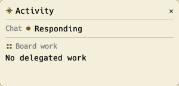
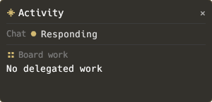

#+title: Review: Board Run Visibility and Completion Handoff
#+startup: overview

* Status

In-review.  All recorded implementation findings are resolved.  The paired
current-configuration cold start, native Board graphical check, and
two-process Grimoire graphical Daily check passed from the current checkouts.
The xwidget-capable build passed a phased WebKit Board interaction gate.
A pointer and pixel playthrough and the complete required-plus-optional
restart scenario still need acceptance evidence.

* Review summary

The owner chat and model context use the same durable Board run projection.
Board activity shows tasks before participant admission through the native or
optional visual view.  Daily uses the canonical owner session and a dedicated
durable queue; completion is a keyed input delivered after an idle boundary.
SQLite schema v9 indexes actionable runs and supports an offline v8-to-v9
backfill.  The final independent pass at e =81fd0163= and Grimoire =a9cef39=
found no P0--P2 issue.  Deterministic repository validation reached a fixed
point.  The stopped configured store was upgraded to v9 and its integrity was
checked.  Feature 89 is merged into both current checkouts.  This HUD
correction was validated in private Emacs processes; it was not loaded into
the user's running Emacs.

* Scope reviewed

The review compared the chat, visual activity, context, completion, single
owner, and restart contracts in =plan.org= with the e and Grimoire changes.
It inspected Board run indexing, exact run reads, native and visual shells,
queue ownership, generation fences, subagent admission, and Daily recovery.
The first independent pass at =c120b637= supplied three visibility findings;
later passes followed their corrections and focused regressions.

* Verification

- At e =81fd0163=, visual ERT passed 16/16.  The combined Board, SQLite,
  queue, recovery, and subagent suite passed 188/188 on its final run.
  An earlier run on that revision passed 187/188: the queue restart test failed
  with =e-task-queue-unknown-task=, passed alone 1/1, then passed in the
  188/188 rerun.  This test has shown intermittent failure under combined load.
- The isolated native Board graphical scenario passed 1/1 at =81fd0163= in a
  private Emacs daemon.  It asserts the displayed fallback and composer state.
- At e =4d3559e3= and Grimoire =a9cef39=, Daily ERT passed 41/41.  The
  isolated two-process graphical Daily queue scenario passed 1/1 in each
  phase.  The subsequent e edit only changes the visual selector action epoch.
- The visual package passed Rust tests 7/7, a real-SQL 257-run test 1/1,
  WASM release build, and web binding generation at =4d3559e3=.
  =cargo fmt --check= could not run because =rustfmt= is absent.
- An expanded 273-test run failed the same queue restart test, which passed
  alone.  The broader graphical suite failed 9/28; its Board reasoning
  timeout was reproduced unchanged at pre-index =c120b637=.  Neither broader
  run is claimed as a passing Feature 89 gate.
- After e =aac4658a=, the paired current-configuration E2E passed 8/8 using
  private copies of the real Doom configuration and package tree pointed at
  this e worktree and Grimoire =a9cef39=.  The native Board graphical selector
  passed 1/1 in the same private configuration.  Both were rerun after the
  restart-test changes, used private Emacs processes, and did not open the
  configured runtime store.
- The isolated Grimoire graphical Daily acceptance ran in two distinct Emacs
  processes after the store upgrade.  Both phases passed 1/1 with
  =E_LISP_DIR=/private/tmp/e-feature89/lisp=.  An earlier attempt omitted that
  variable; Grimoire's helper loaded the canonical v8 worker and rejected
  =board-orchestration-active-runs=.  That mixed-source failure does not
  describe the paired Feature 89 code.
- At e =aac4658a=, four selected restart checks passed together 4/4:
  required-plus-optional reduction, exact queue-assignment reconciliation,
  pending-claim restart with FIFO delivery, and post-publication restart with
  coordinator-outcome backfill.  The pending-claim scenario keeps an optional
  task running after required work settles and checks that the coordinator
  input still names it.  The queue test now checks durable terminal state
  because the storage-backed queue evicts terminal records from its
  process-local cache.  An earlier combined run exposed that test race.
- With Emacs stopped, the configured =store.sqlite3= reports
  =store_meta.schema_version= as =9= and =PRAGMA integrity_check= returns =ok=.
  The single retained =store-pre-feature89-v8-20260926.sqlite3= backup reports
  schema 8 and =quick_check= returns =ok=.  The superseded 2026-09-21 backup
  was removed.  The Feature 89 worker then opened the configured store in
  =read-only= mode and reported =:startup ready=, =:unavailable nil=, and no
  startup error.  This validates code/schema compatibility without starting
  the user's Emacs.
- In the current checkouts, e =b8a336de= merged Feature 89 and Grimoire
  =face6e4= contains the Daily integration.  Grimoire Daily ERT passed 42/42.
  =bash e2e/run-current-config-tests.sh= passed 8/8 using private runtime state,
  and the native Board graphical selector passed 1/1.  The latter took 62.15
  seconds in the current configuration; its opening interaction is asserted
  under one second, so this total is not an interaction-latency measurement.
- The two-process Grimoire graphical Daily acceptance passed 1/1 in each
  fresh Emacs process with =E_LISP_DIR= and =E_GRAPHICAL_E2E_RUNNER= set to the
  current e checkout, running
  =.e/layers/topic/test/run-graphical-daily-acceptance.sh=.  The first process
  logged a =tmp://= write failure while the fixture closed its store; its
  saved Daily commit and the second process's reopen assertions passed.
  The integrated e worker independently opened the configured store with
  =:schema-version 9= and =:access-mode read-only=.
- After reinstalling Emacs 31.1 with =--with-xwidgets=, visual ERT passed
  17/17 and =bash e2e/run-current-config-tests.sh= passed 8/8.  The new
  =bash e2e/run-board-visual-tests.sh= passed through one private configured
  graphical daemon: public chat status opened a live WebKit xwidget; its
  Board WASM canvas initialized; WebKit received the pending required and
  running optional task cards, including the latter's live control; the
  owner composer accepted input; a WebKit-originated semantic selection
  reached Emacs; and a Board update retained the selected task.  A single
  =emacsclient= evaluation cannot observe WebKit navigation before returning,
  so the test uses bounded separate calls and private runtime state.
  The ignored WASM package in this checkout came from the prior Feature 89
  build; its Board source tree matched byte-for-byte, and the copied WASM hash
  matched.  =wasm-pack= is absent on this host, so this was not a fresh build.
  The source guard now checks native =xwidget-internal= rather than the Lisp
  WebKit command, which exists even in builds without xwidgets.
- The four selected restart checks re-passed 4/4 on the integrated checkout
  after the xwidget rebuild.  They verify separate queue, required/optional,
  pending-delivery FIFO, and outcome-backfill boundaries; they do not join
  every crash point into one continuous scenario.
- After the chat-overlay correction, focused Board shell and visual ERT passed
  28/28.  The private current-configuration native graphical scenario passed
  1/1 with a child-frame opening and dismissal check.  The private phased
  WebKit E2E passed: the real Board WASM view opened in a child frame over
  chat, accepted the selected-run page and a task action, retained selection
  after an update, kept the composer active, and dismissed back to chat.
- After the HUD correction, Rust tests passed 7/7 and visual ERT passed
  17/17.  The Board WASM was rebuilt for =wasm32-unknown-unknown= and bound
  with =wasm-bindgen 0.2.126=.  The private phased WebKit E2E passed: the
  public chat status opened an approximately 300-pixel-wide, focusless child
  frame at the top right while chat kept focus; WebKit received the pending
  required and running optional task rows; =Details= opened the large focused
  view; the task action and update passed; =HUD= returned to the compact frame
  and chat focus.  The focusless off-screen WebKit frame delayed its first
  animation-frame callback, so the canvas visibility class is set immediately
  after WASM initialization.  This gate checks frame geometry and WebKit
  state delivery, not a human-visible pixel or pointer playthrough.
- The current-configuration native graphical fallback passed 1/1 after the
  HUD change, using a private state directory.  The isolated bootstrap
  failed before test execution with an Emacs 31 macro-expansion cycle, so it
  supplies no Board result.  Focused Board shell and visual ERT passed 28/28;
  =bash e2e/run-current-config-tests.sh= passed 8/8 with private state.
- After automatic HUD opening, focused Board activity ERT passed 29/29,
  including a WebKit buffer-rename ownership regression.  Chat tests passed
  316/316.  The current-configuration cold start passed 8/8 and the private
  native Board graphical scenario passed 1/1 with visual auto-opening isolated
  from its text-renderer fixture.  The phased WebKit E2E passed twice against
  the rebuilt WASM: opening an empty chat automatically displayed the HUD,
  dismissal was respected, the status reopened it for a two-task run, the
  composer retained focus, the full view handled a real WebKit-origin task
  action, and an explicit native fallback closed the visual child frame.
  Presentation mode switches were driven through the semantic handler in the
  transparent off-screen test frame because WebKit deferred synthetic fetches
  there.  Pointer clicks and visible pixels remain unverified.  One earlier
  combined native test stalled with an auto-open WebKit frame and was stopped;
  the isolated native scenario and phased cross-renderer handoff then passed.
- After the user's screenshot exposed the unbound inspector, Board activity
  ERT passed 30/30 and Rust tests passed 8/8.  The rebuilt WASM passed the
  phased WebKit test with a separate idle phase: the chat opened the compact
  frame and WebKit received an initial snapshot before any run facts were
  published or a test-driven push occurred.  The later two-task, Details,
  task-action, HUD, and native-handoff phases also passed.  The private
  current-configuration cold start passed 8/8.  The final button styling
  rebuild passed the WebKit test again.  The preview is illustrative; corrected
  visible pixels and real pointer clicks have not been checked.
- After the second screenshot, the live read-only chat probe reported a
  completed chat turn.  The user's Emacs process had started at 15:41, before
  the compact HUD fix was committed; its displayed =Details ↗= control and
  large empty layout match the earlier WASM renderer.  The follow-up change
  passed 36/36 focused Board/chat-surface ERT, 76/76 broader chat ERT, 9/9
  Rust tests, and the private current-configuration cold start 8/8.  The
  rebuilt private WebKit gate passed an idle frame height check and a real
  composer submission with a streamed provider reply.  WebKit received both
  =streaming= and =done= chat states while Board work remained empty.  Its
  two-task and handoff phases also passed.  The user's Emacs was only probed;
  it was not reloaded.
- After the user's split-window screenshot, the private WebKit gate opened a
  chat with an unrelated pane beside it, then moved the chat below another
  pane.  The compact HUD followed the output window's right and upper edges
  in both layouts, while the submitted chat turn, two-task view, and native
  handoff phases still passed.  Focused Board shell and visual ERT passed
  31/31.  The user's Emacs was not reloaded.
- After the font complaint, the current Doom configuration was checked and
  selects Menlo at size 13.  The private WebKit gate received the local Menlo
  path, loaded it into egui, and passed its chat, split-window, task, and
  handoff phases with the rebuilt WASM.  A macOS Rust test rendered through
  egui with the installed Menlo collection; Rust passed 10/10 and visual ERT
  passed 20/20.  The font is read locally when the owner frame uses Menlo;
  the WASM asset does not contain its bytes.  The stable Rust toolchain lacks
  =rustfmt=; a later installed toolchain's format check reports pre-existing
  formatting differences elsewhere in the Board source.

* Findings

** DONE Medium: The HUD used egui's mismatched proportional font

The compact view used egui's light Ubuntu font at 11--12 points while the
user's Doom configuration selected Menlo 13.  The Board canvas now requests
the installed Menlo collection through the local file gateway when the owner
frame uses it.  All Board text uses monospace; egui's bundled Hack font is the
fallback when Menlo is absent.  The private WebKit test waits for the font to
be applied before testing the HUD.  Visible glyph appearance still needs a
pixel check in a normal on-screen frame.

** DONE Medium: The HUD floated over an unrelated Daily pane

The screenshot showed the chat output in the lower portion of the frame, but
the HUD stayed at the frame's upper-right corner over the Daily document.
The popup shell now anchors its compact child frame to the visible owner-chat
output window.  It fits within that window and schedules a position refresh
when the window layout changes.  Dismissal removes the window observer.  A
private graphical test moves the chat below an unrelated pane and checks the
HUD's edges against the chat output, not the outer frame.

** DONE Medium: The idle HUD implied every chat message should create a run

The second screenshot showed =No run selected= after an ordinary chat message.
That is technically possible because a Board run is delegated task work, not
every chat turn, but the HUD gave no visible account of the chat turn.  The
compact view now has a transient Chat row driven by the chat surface and a
separate Board work row.  With no delegated work it says =No delegated work=,
hides =Details=, and uses a shorter idle frame.  A chat status hook refreshes
the HUD without querying or creating Board facts.  The focused tests cover
listener cleanup; the private WebKit test submits a real chat message,
streams a reply, and observes both active and settled HUD states.

** DONE High: An idle WebKit canvas displayed the full inspector

The user's screenshot showed the =HUD= button, large inspector headings, and
=Waiting for Board run state= inside the chat overlay.  Rust initialized with
=compact=false=, while the first Elisp snapshot could be sent before WebKit
installed its state bridge.  The canvas now starts in compact mode and asks
Elisp for the current snapshot after its bridge is ready, retrying until state
arrives.  The compact renderer uses smaller type, tighter rows, and a 230-pixel
frame height.  The private WebKit test now waits for the first idle snapshot
before publishing any Board task facts; the [[file:board-hud-preview.html][layout preview]] records the
intended compact proportions.  The user's screenshot proves the earlier
failure, not the corrected pixels; a visible playthrough is still needed.

** DONE High: The HUD required a separate status click after opening chat

The compact HUD was initially available only through the run status action.
Chat display now opens it once the Board binding is ready, including an idle
Board.  Dismissal is remembered for that chat until the user activates its
status.  WebKit can rename the visual buffer after startup, so the visual
shell tracks its live buffer identity when rebinding or closing it; native
fallback then closes that child frame before opening its own view.  The
private WebKit and native tests above cover those transitions.

** DONE High: The first floating Board view obscured chat

The first overlay used 82% of the chat frame and focused its full inspector
on opening.  That missed the small status card shown in
[[https://github.com/nohzafk/emacs-workspace-hud][emacs-workspace-hud]].
The chat action now opens a roughly 300-pixel top-right HUD without taking
focus.  Its required and optional task rows retain pending-admission
visibility; the full inspector requires =Details=.  The private WebKit E2E
checks compact geometry, focus, state delivery, expansion, and return.

** DONE High: Board activity replaced the chat instead of floating over it

The initial plan explicitly chose a normal xwidget buffer and rejected a
floating child frame, which missed the intended hover-over-chat interaction.
The visual and native public open paths now display the same Board-owned page
in a posframe child of the chat frame when graphical child frames are
available.  =q= and =C-g= dismiss the view without killing the Board buffer;
detail and participant navigation return to the outer frame.  The graphical
fallback uses an ordinary window when a child frame is unavailable.  The
private graphical tests above cover opening, chat layout and composer
retention, repeated opening, dismissal, and WebKit delivery in the child frame.

** DONE High: Older active run disappears behind completed history

The plan requires every actionable run in the shared projection.  At
=c120b637=, SQL selected the newest 32 manifests before filtering completed
runs, so an older active run could disappear from status, context, and
continuation reconciliation.  =44af350f= added a transactionally rebuilt run
index and offline v8-to-v9 backfill.  Combined ERT covers older active runs,
exact counts, paging, and migration.

** DONE High: Native Board activity is not displayed from chat

The chat status action and text command created a native buffer without
displaying it when xwidgets were unavailable.  =c0aa3a2d= made both routes
display the buffer.  The isolated graphical fallback scenario asserts the
selected window and passed again at =81fd0163=.

** DONE Medium: Open native Board activity does not follow Board updates

The native view previously refreshed only on local actions, leaving rows
stale after another actor committed a Board change.  =acec9aff= added a
coalesced Board subscription, selection retention, and cleanup on rebind or
kill.  Native shell ERT and the isolated graphical scenario passed.

** DONE High: Subagent participant admission races Board clear

A child could pass an early generation check and admit a participant after
Board clear.  =5d2ee1f6=, =c43bb97f=, and =26cfcc01= fence queued work,
claims, and participant admission by current Board generation.  The last
step makes admission atomic with the Board write.  Combined ERT exercises
stale generations before and during admission.

** DONE Medium: Cleared Daily queue owner can remain attached indefinitely

Daily must retain a strong queue owner while cleared-run tasks drain, but a
process-local check could miss the release point.  Grimoire =e16eaa8=
releases it only after indexed SQL reports zero unsettled rows; e =3b70573e=
provides the durable exact count.  Daily ERT and the two-process queue test
cover ownership through recovery and release.

** DONE Medium: Visual run selector cannot reach older active runs

The expanded visual query stopped at 256 manifests even when the shared
projection reported omissions.  =4d3559e3= replaced it with one indexed
64-run page at a time and Browse, Next, and Current actions.  The real-SQL
257-run test reaches the final run without retaining earlier pages; visual
ERT covers stale cursors and navigation.

** DONE Low: Daily model guidance describes retired routing

The Daily skill still described an update session and obsolete queue and
restart behavior.  Grimoire =01349b5= corrected the guide after production
moved to the canonical owner.  Source review and Daily tests check the
dedicated queue path; the guide no longer instructs the old path.

** DONE High: Acknowledged dispatch failure can publish two terminal reports

When e had already published a subagent dispatch failure to the Board,
Daily's queue consumer could publish a second conflicting terminal report.
Grimoire =a9cef39= settles the queue after the acknowledged failure without
re-reporting it.  Its real-SQL regression is included in the 41/41 Daily run.

** DONE Medium: Stale visual control can pass after same-Board rebind

At =4d3559e3=, a new binding took its epoch from a global counter, but local
navigation could advance past that counter.  Reopening the same Board could
reuse an old epoch and admit an old interrupt or shutdown click when task
coordinates still matched.  =81fd0163= uses one process-monotone allocator
for rebind, run-set updates, page navigation, and Current.  Its regression
recreates the collision, rejects both stale controls, and accepts current
controls; visual ERT passed 16/16.

* Plan coverage

- Slices 1-5: shared bounded projection, owner-chat status and detail,
  context, keyed completion, and idle FIFO delivery have focused e evidence.
  Native graphical coverage includes the idle composer and Board fallback.
- Slice 2b: the visual view model, Rust/WASM app, indexed run browsing, popup
  presentation, and action guards have focused and build evidence.  The real
  xwidget and WASM state/action bridge passed in a child frame; pointer-driven
  and pixel-rendering inspection remain unverified.
- Slice 6: Grimoire uses one canonical owner session and Board for interactive
  and headless Daily dispatch.  Old =E_UPDATE_SESSION= routing was removed;
  the production queue consumer and its guidance are updated.
- Slice 7: stable queue assignment, generation-fenced recovery, offline
  schema backfill, and two-process Daily recovery are implemented.  The
  configured store was upgraded and checked.  Selected tests prove the
  required-plus-optional policy and several restart boundaries separately;
  the complete scenario across every boundary remains unproved as one
  acceptance scenario.

* Architecture review and design self-check

1. This stopping point provides durable visibility, exact recovery, and
   single-owner Daily dispatch, although remaining gates keep it =In-review=.
2. It moves toward one Board-owned run authority and one owner-chat handoff.
3. Stable run and queue identities are direct contracts.  Visual layout and
   paging stay local and rebuildable; uncertain UI behavior is not persisted.
4. Board orchestration owns run policy, the queue owns task execution, chat
   service owns keyed owner input, and shells own presentation, including the
   floating Board frame, transient chat status, and its focus return.
5. The Board observation page and queue bridge are narrow joins.  The visual
   shell consumes detached facts without owning another durable inventory.
6. Core policy does not depend on Rust, xwidgets, Grimoire, or a shell.
   Daily depends on e's Board and queue contracts.
7. SQLite and worker dispatch side effects remain in their owning services;
   the reducer and visual view model map committed facts.
8. Schema v9 stores the run index and queue facts because restart requires
   them.  Selection, cursors, focus, popup frame, and progress stay transient.
   Chat status, the selected font path, and WebKit font bytes stay transient;
   the ready retry ends at its first snapshot and is page-local.
   Cleared queue ownership lasts only until SQL confirms drain.
9. Indexed reads return bounded pages.  Floating presentation adds one child
   frame on open and no Board query.  Window changes compare one visible chat
   window's edges and schedule a move only when they differ.  The ready request
   backs off to a four-second interval only while the first snapshot is
   missing.  Chat status changes coalesce one visual snapshot without a Board
   query.  Menlo adds one local collection read per WebKit page that selects
   it; there is no remote font request.  A
   1024-fact append witness took 187 ms
   (0.183 ms/fact), but representative interactive latency and per-Board-write
   production cost are unmeasured.
10. The Board page, queue assignment identity, and keyed input have concrete
    contracts; neither renderer must fake an unsupported operation.
11. The v8-to-v9 upgrade is explicit and offline.  Update-session routing is
    removed; native rendering remains supported without xwidgets.
12. The second coordinator and expanded 256-run visual scan were removed.
13. Stale actions and generations are rejected at service boundaries.
    Unexpected store and dispatch failures surface as failed work or attention.
14. Reducer, SQL, queue, admission, and action-fence tests prove behavior below
    the graphical shell.  Isolated graphical tests and the paired private
    current-configuration cold start cover their joins.  The graphical native
    and phased xwidget tests cover floating frame ownership, dismissal,
    initial idle state delivery, an ordinary submitted chat turn, split-window
    HUD placement, Menlo load, and state/action exchange; pointer pixels and
    the full restart scenario remain necessary.

* UX and performance playthrough

The private native graphical frame exercised an idle owner chat, a pending
task without a participant, an editable composer during a held Board read,
opening the status into a displayed activity buffer, and reopening after a
Board update.  The two-process Daily graphical fixture exercised durable
queue recovery.  The earlier Emacs 31.1 build lacked xwidgets, so the app was
initially checked through view-model and event tests.  The rebuilt xwidget
version passed the phased WebKit gate described above.  The off-screen
WebGL canvas returned a black PNG capture, and macOS window capture of a
private visible test frame did not produce an image.  These checks do not
prove the drawn pixels or a pointer click.  The graphical checks used private
processes; the user's running Emacs was read only probed after the screenshots.

The corrected graphical path now floats both renderers over the chat frame.
The native test dismisses and reopens it without losing the chat composer;
the WebKit test verifies the child frame, underlying composer, Board state
delivery, and focus return on dismissal.  These tests still do not establish
the drawn pixels or a physical pointer click.

The compact WebKit HUD now paints a warm surface derived from the Emacs theme
and draws small pictograms for its title, chat state, and Board work.  Named
Emacs colors are converted and the boot surface gets a non-null background
before egui applies them.  Rust tests passed 11/11, and the standard private
current-config WebKit gate completed its Menlo, chat, task, focus, and handoff
phases with the rebuilt WASM.  Private headless Chrome rendered the actual WASM at 300x145 with a
streaming chat state; the inspected  and
 images show the tint, text, and drawn pictograms.
This proves the renderer pixels in Chrome, while xwidget pixels and a physical
pointer click still need verification.

* Unresolved acceptance and activation

- Inspect the Board's drawn cards and use a real pointer click in an
  xwidget-capable frame.  The private phased gate already proves pending
  admission, live control data, Board update, selection retention, and
  composer input across the native WebKit bridge.
- Run the complete required-plus-optional restart scenario from =plan.org=
  across pre-persistence, pre-publication, post-publication, post-consumption,
  and coordinator-outcome boundaries.  Measure realistic Board write and
  visual refresh latency before asserting an interactive performance bound.
- Restart Emacs to activate the latest HUD and integrated core source.
  The current Grimoire checkout retains unrelated local edits; preserve them
  during any later work.

The user's Emacs is running code loaded before the latest HUD changes.  The
configured store has been upgraded; the core changes need a full restart.
A shell reload cannot apply them.
